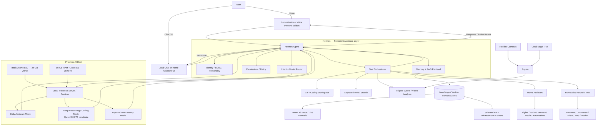

# Local AI / Hermes Virtual Assistant Architecture

> Status: Deferred design — implement only after the current HomeLab roadmap completion gates pass.
>
> Purpose: Define the target hardware/software process flow for a local, multi-model virtual assistant controlled by Hermes Agent.

## Design Principles

- Hermes Agent is the controlling/orchestration layer and the persistent assistant identity.
- Local LLMs are replaceable reasoning engines behind Hermes rather than separate assistants.
- Home Assistant remains the authoritative home-automation platform; Hermes invokes it through bounded tools/APIs.
- Infrastructure administration must use explicit permissions, auditability and least privilege.
- Frigate object detection remains on the dedicated Coral Edge TPU; the Intel GPU is reserved primarily for local AI and advanced analysis workloads.
- Long-term knowledge should use memory/RAG and selective retrieval rather than injecting the entire knowledge base into every prompt.
- Model routing should favor responsiveness for routine assistant work and deeper reasoning for coding/engineering work.

## Target Hardware

### Proxmox AI Host

- Dell Precision T5810 / existing Proxmox platform
- Intel Xeon E5-2698 v4 class upgraded CPU
- 80 GB system RAM
- ASRock Intel Arc Pro B60
  - 24 GB GDDR6 VRAM
  - Primary accelerator for local LLM inference
- Existing 10 GbE network connectivity

### Dedicated Vision Accelerator

- Coral Edge TPU
- Remains assigned to Frigate object detection

### Voice Endpoint

- Home Assistant Voice Preview Edition
- Local microphone/speaker endpoint for household interaction

## Core Software Layers

1. **User / Voice / Chat Interfaces**
   - Home Assistant Voice Preview Edition
   - Home Assistant dashboards
   - Optional local web/chat interface

2. **Hermes Agent — Orchestration and Identity**
   - Persistent assistant identity/personality and SOUL configuration
   - Conversation/session handling
   - Tool selection and execution
   - Model routing
   - Permissions and policy enforcement
   - Memory/RAG retrieval
   - Task escalation between fast and deep models

3. **Local Model Serving Layer**
   - Intel Arc Pro B60 accelerated runtime
   - Ollama or another B60-compatible inference server selected after benchmarking
   - OpenAI-compatible API where practical

4. **Model Pool**
   - Daily assistant model: responsive, strong tool use, Home Assistant and HomeLab operations
   - Deep-reasoning/coding model: Qwen 3.8 27B is a leading candidate; prioritize thorough reasoning, debugging and experimental vibe coding
   - Optional lightweight low-latency model for simple voice/home-control requests
   - Final models chosen by real B60 benchmarks rather than specification alone

5. **Memory and Retrieval Layer**
   - Personal/assistant memory
   - HomeLab repository and documentation
   - Infrastructure inventory/runbooks
   - Home Assistant entity/context data
   - Selected manuals and local knowledge
   - Retrieval pipeline supplies only relevant context to each request

6. **Tools and Controlled Endpoints**
   - Home Assistant API/services
   - Proxmox
   - OPNsense
   - Arista EOS
   - TrueNAS and Synology
   - Docker/Portainer and hosted services
   - Beszel / HomeLab Doctor / future Prometheus-Grafana telemetry
   - Git repositories and coding workspace
   - Frigate events and recordings
   - Approved web/search services

## Process Flow

## Example Routing

### Routine Home Command

`Voice -> Hermes -> low-latency/daily model -> Home Assistant tool -> device action -> Hermes -> spoken confirmation`

Example: "Turn off the downstairs lights except the hallway."

### HomeLab Operational Query

`User -> Hermes -> memory/RAG + daily model -> HomeLab monitoring/tool APIs -> model synthesis -> response`

Example: "Is Jellyfin down, or is this another network issue?"

### Deep Engineering / Vibe-Coding Task

`User -> Hermes -> deep-model route -> retrieve repository/docs -> coding workspace/tools -> test/iterate -> Hermes -> result`

Example: "Build a service that takes Frigate vehicle detections, identifies make/model and plate, and publishes the result to Home Assistant."

## Post-Current-Project Requirements

### Hardware and Runtime

- [ ] Install and validate the ASRock Intel Arc Pro B60 24 GB in the Proxmox host
- [ ] Validate PSU, cooling, PCIe placement and sustained GPU load
- [ ] Establish stable Intel Arc Pro Linux drivers and compute runtime
- [ ] Decide the cleanest GPU ownership model: direct host use, VM passthrough or dedicated AI VM
- [ ] Verify reboot-safe GPU initialization and recovery

### Local Model Platform

- [ ] Benchmark candidate B60-compatible inference stacks before standardizing on Ollama or an alternative
- [ ] Measure prompt-processing speed, generation speed, VRAM use, context scaling and stability
- [ ] Benchmark a daily assistant candidate set
- [ ] Benchmark Qwen 3.8 27B as a deep-reasoning/coding candidate
- [ ] Test at least one smaller low-latency model for routine voice control
- [ ] Define model load/unload policy so multiple models can share the 24 GB B60 without requiring simultaneous residency

### Hermes Agent

- [ ] Retain Hermes as the single controlling agent and assistant identity
- [ ] Define SOUL/personality/intention configuration separately from model weights
- [ ] Implement intent-based model routing
- [ ] Implement bounded tool calling with least-privilege credentials
- [ ] Define confirmation requirements for destructive or high-impact infrastructure actions
- [ ] Add action logging/audit history

### Memory and Knowledge

- [ ] Design persistent assistant memory
- [ ] Implement RAG over HomeLab documentation and selected repositories
- [ ] Add infrastructure inventory/runbook retrieval
- [ ] Define what Home Assistant state may be dynamically injected into context
- [ ] Establish retention/privacy rules for personal and household data
- [ ] Validate retrieval quality before increasing context-window size

### Home Assistant / Voice

- [ ] Integrate Home Assistant Voice Preview Edition with the Hermes-controlled workflow
- [ ] Keep Home Assistant authoritative for devices and automations
- [ ] Validate conversational home control with low perceived latency
- [ ] Support natural questions that combine Home Assistant state with external/general knowledge
- [ ] Define offline/failure behavior when Hermes or the model server is unavailable

### HomeLab Administration

- [ ] Provide read-only infrastructure tools first
- [ ] Add bounded write/remediation actions only after read-only behavior is proven
- [ ] Integrate HomeLab Doctor/Beszel and later Prometheus/Grafana data where useful
- [ ] Add Proxmox, OPNsense, Arista, NAS and Docker tooling incrementally
- [ ] Prevent a model from bypassing VLAN/security policy through broad privileged credentials

### Coding / Experimental Work

- [ ] Provide the deep model with a controlled Git/coding workspace
- [ ] Support repository retrieval, diff generation, tests and iterative debugging
- [ ] Keep production write/push permissions separate from coding/model reasoning
- [ ] Benchmark Qwen 3.8 27B against other strong coding models on real HomeLab tasks

### Frigate / Vision Boundary

- [ ] Keep Coral TPU as Frigate's primary object detector
- [ ] Allow Hermes to consume Frigate events and metadata
- [ ] Evaluate B60 inference for secondary image/video interpretation only when justified
- [ ] Design future vehicle make/model/license-plate enrichment as a separate bounded pipeline

### Operations, Safety and Recovery

- [ ] Monitor Hermes, inference server, GPU, model availability and memory pressure
- [ ] Back up Hermes configuration, SOUL/personality, tool configuration and memory stores
- [ ] Treat downloadable model weights as reproducible data unless a specific model requires backup
- [ ] Document rebuild and rollback procedures
- [ ] Validate host/guest reboot recovery
- [ ] Establish failure modes that leave Home Assistant and core HomeLab services usable without AI

## Completion Gate

The local assistant is considered production-ready only when Hermes can reliably route between at least a responsive daily model and a deep-reasoning model, use Home Assistant and approved HomeLab tools with bounded permissions, retrieve relevant long-term knowledge without excessive context injection, recover cleanly after reboot/failure, and operate without making Home Assistant, networking, surveillance or other core services dependent on the AI stack.
