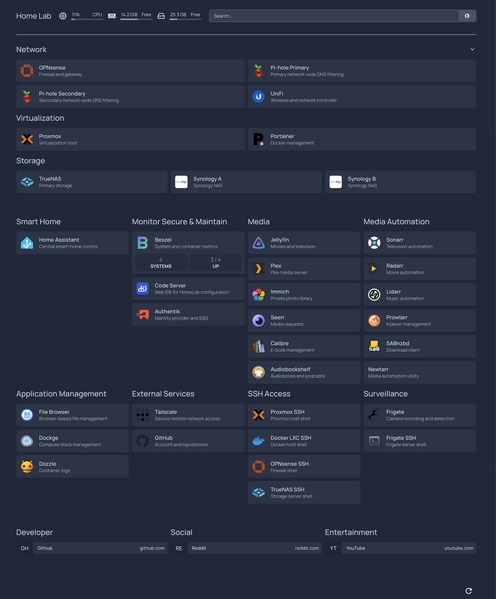

# Operations

SSH shortcuts:
- ssh proxmox
- ssh docker
- ssh opnsense
- ssh truenas
- ssh frigate
- ssh nut

## Authorization

- Nginx Proxy Manager: `https://proxy.elliottrook.com`
- Expected login chain: Authentik password, WebAuthn/passkey, then NPM credentials
- State: tested and working on 2026-08-22
- Direct fallback: `http://192.168.50.23:81` from trusted management networks
- Detailed validation, regeneration and rollback procedure: [Authorization](08-Authorization.md)
- Repeatable process for each additional service: [Service Authorization Onboarding](09-Service-Authorization-Onboarding.md)

## Service dashboard

- LAN and Tailscale URL: `http://home.internal:3000`
- Direct fallback: `http://192.168.20.20:3000`
- Homepage configuration: `/opt/homepage/config` inside Proxmox LXC 100 (`docker`)
- The `SSH Access` group launches the local SSH client for Proxmox, Docker LXC, OPNsense and TrueNAS.
- `Security & Operations` groups Beszel, Code Server, Authentik, Dockge, Dozzle and Nginx Proxy Manager.
- `AI & Automation` identifies the isolated Hermes and Ollama pilots without publishing inaccessible direct links.
- `Application Management` contains File Browser and Forgejo.
- `Security & Surveillance` links to Frigate and launches its SSH connection.

Optional OPNsense, Proxmox and TrueNAS API widgets are intentionally deferred to
a separately scoped dashboard enhancement. Deploy them only with dedicated
least-privilege read-only credentials; never place reusable API secrets directly
in the tracked Homepage YAML.

Dashboard SSH targets:

| Tile | Target |
|---|---|
| Proxmox SSH | `ssh://root@192.168.50.10` |
| Docker LXC SSH | `ssh://root@192.168.20.20` |
| OPNsense SSH | `ssh://root@192.168.1.1` |
| TrueNAS SSH | `ssh://truenas_admin@192.168.20.40` |
| Frigate SSH | `ssh://jelliott@192.168.20.10` |

The client device must have an application registered to handle `ssh://` links. These links do not contain passwords or private keys.

## UPS / power monitoring

Quick reference for checking UPS status without opening a browser:

```sh
ssh nut "upsc -l"                              # list all three UPS units
ssh nut "upsc proxmox-ups@localhost"           # full status for one unit
ssh nut "upsc nas-ups@localhost ups.status"    # single field
ssh nut "upsc network-ups@localhost ups.status"
```

`ups.status` of `OL` means on mains and healthy; `OB` means on battery;
`LB` means the unit has crossed its configured low-battery threshold
(`nas-ups`=50%, `proxmox-ups`=80%, `network-ups`=25% — not the hardware
default). HomeLab Doctor's `check_nut` and `check_backup_age "NUT"`
cover the same ground automatically, and Beszel shows the Lenovo's own
host-level metrics (not UPS-specific data) in its dashboard.

Full architecture, shutdown behavior and recovery notes:
[UPS-Power-Resilience-Claude-Handover.md](UPS-Power-Resilience-Claude-Handover.md).

## Activity log — 2026-08-22

The Homepage operations dashboard and its editing workflow were reviewed and validated.

- Deployed and validated code-server in Docker LXC 100 as the HomeLab configuration editor.
- Mounted `/opt/homepage` directly into the code-server workspace so the live Homepage files remain the source of truth, then corrected ownership so code-server can save the YAML configuration.
- Added Code Server and Authentik tiles to Homepage.
- Corrected internal service links that stalled over HTTPS, retained HTTPS where intentional and corrected a changed NAS application port.
- Verified the dashboard groups and links across the current HomeLab service inventory.

The dashboard now acts as an operational overview of the current HomeLab service layer.



## Network incident — 2026-08-23

A storm caused a site power interruption. The UniFi PoE switch did not return to service when power was restored, repeating its previous failure-to-boot behaviour.

- Standard power-cycle and recovery attempts did not restore the UniFi switch.
- A TP-Link TL-SG1016PE V2 was connected as a temporary PoE fallback, with its uplink on port 16, access points on ports 1 and 3, and the Reolink camera initially on port 2.
- Arista Et33 remained connected and unchanged. It continued to learn downstream access-point and client MAC addresses and showed tagged traffic on VLANs 30, 40 and 50.
- Because the TP-Link was not configured for VLANs, the camera appeared temporarily on Trusted VLAN 10 instead of Cameras VLAN 60. The camera was disconnected while switch management was investigated.
- The TP-Link continued forwarding Ethernet and supplying PoE, but neither its web-management interface nor the Easy Smart discovery utility responded. Direct connection, alternate cables and ports, and a factory reset did not restore management access. The TP-Link was rejected as a manageable replacement.
- After approximately one hour, the UniFi switch started without further intervention. The access points and other attached services reconnected.

Service was restored, but the delayed recovery confirms that the UniFi PoE switch is not reliable after a power interruption. Return or replace it with a stable managed PoE switch that supports the existing native VLAN 10 and tagged VLANs 30, 40, 50 and 60. Before closing the incident, confirm that the Reolink camera is again on `192.168.60.10` and that Frigate recording has resumed.

The Mac SSH client uses the same `~/.ssh/id_ed25519` identity for the documented aliases. OPNsense and Frigate accept its public key, while the private key remains on the Mac. `AddKeysToAgent yes` and `UseKeychain yes` allow macOS to retrieve the passphrase from Apple Keychain and load the identity into `ssh-agent`; FileVault and automatic screen locking remain important because an unlocked user session can use the loaded key.

Validated commands:

```sh
ssh -o BatchMode=yes opnsense 'echo OPNsense-SSH-KEY-OK'
ssh -o BatchMode=yes frigate 'echo Frigate-SSH-KEY-OK'
lab ssh frigate
```

## Frigate operations

- VM: Proxmox VM 102, Debian 13.6, `192.168.20.10` on VLAN 20
- Compose project: `/opt/frigate`
- Web interface: `https://192.168.20.10:8971`
- Configuration: `/opt/frigate/config`
- Recording mount: `/opt/frigate/storage`
- TrueNAS export: `192.168.20.40:/mnt/Media/Surveillance/Frigate`
- Startup unit: `frigate-compose.service`

Health check:

```sh
findmnt -rn -t nfs4 -T /opt/frigate/storage
systemctl is-active frigate-compose.service
cd /opt/frigate
sudo docker compose ps
sudo find /opt/frigate/storage/recordings -type f -mmin -3 | head
```

The systemd service waits until the real NFSv4 mount is available before
starting Compose. Docker's container restart policy is disabled for this stack;
systemd owns startup and recovery so Docker cannot race the NFS mount during
boot. Do not replace the mount with the local directory if TrueNAS is
unavailable.

The dated Frigate configuration archive contains camera credentials and must
remain outside Git with mode `0600`. Recordings are not included in the
configuration archive because they remain on the TrueNAS surveillance dataset.

## Redundant Pi-hole DNS

- Primary host: Proxmox LXC 100 (`docker`), `192.168.20.20` on Servers VLAN 20
- Compose project: `/opt/pihole`
- Persistent configuration: `/opt/pihole/etc-pihole`
- Primary image: `pihole/pihole:2026.05.0`; internal hostname: `pihole-primary`
- Primary endpoints: `192.168.20.20:53` over TCP/UDP and `http://192.168.20.20:8082/admin/`
- Secondary host: TrueNAS App `pihole`, `192.168.20.40`
- Secondary image observed during rollout: `pihole/pihole:2026.07.2`
- Secondary endpoints: `192.168.20.40:53` over TCP/UDP and `http://192.168.20.40:20720/admin/`
- Upstream resolver: OPNsense Unbound at `192.168.1.1`
- Public, blocked-domain and `internal` resolution passed through both instances.
- DHCP remains on OPNsense; Pi-hole DHCP is disabled.
- OPNsense Dnsmasq sends `192.168.20.20,192.168.20.40` as DHCPv4 option 6 on every configured DHCP range.
- `PIHOLE_DNS_SERVERS` contains both resolvers; `PIHOLE_CLIENT_NETWORKS` contains VLANs 20 through 70.
- The floating `Allow client VLANs to Pi-hole DNS` rule permits only TCP/UDP 53 and precedes the existing RFC1918 isolation blocks.

Health and validation:

```sh
# Run in LXC 100
cd /opt/pihole
docker compose ps
docker compose logs --tail 100

# Run from a LAN client
dig +short @192.168.20.20 example.com
dig +short @192.168.20.20 home.internal
dig +short @192.168.20.20 doubleclick.net
dig +short @192.168.20.40 example.com
dig +short @192.168.20.40 home.internal
dig +short @192.168.20.40 doubleclick.net
```

Expected results from either resolver are public addresses for `example.com`, `192.168.20.20` for `home.internal`, and `0.0.0.0` for a blocked `doubleclick.net` query.

Network-wide rollback:

1. Remove or disable the untagged Dnsmasq DHCP option 6 and apply changes. Dnsmasq will resume advertising the receiving OPNsense interface as DNS.
2. Renew a test client's DHCP lease and confirm it receives the OPNsense interface address.
3. Disable the consolidated floating Pi-hole rule only after clients have moved back; the aliases can remain without affecting traffic.

DHCP-provided DNS does not force clients to use port 53. iCloud Private Relay, VPNs and encrypted-DNS profiles may bypass the Pi-hole pair unless a separate, explicitly approved enforcement policy is deployed.

## Home Assistant pilot

- Platform: Home Assistant OS 18.2 in Proxmox VM 103
- Address: `192.168.20.11` on Servers VLAN 20
- Local URL: `http://home-assistant.home.internal` (TCP 80 in the current HAOS deployment)
- Resources: 2 vCPU, 4 GB RAM, 32 GB SCSI disk
- Proxmox settings: OVMF, Q35, VirtIO NIC tagged VLAN 20, automatic startup enabled
- DHCP/DNS: Dnsmasq host reservation for MAC `BC:24:11:08:16:A3`; domain `home.internal`
- Initial recovery point: full Home Assistant backup `Fresh HAOS installation`
- First integration: Philips Hue bridge `192.168.30.164`
- IoT firewall access: TCP/UDP from Home Assistant host `192.168.20.11` to IoT VLAN 30, above the general Servers RFC1918 block
- Lutron Caséta bridge: reserved `192.168.30.102`; devices imported and control validated
- Hue bridge: reserved `192.168.30.164`; devices imported
- Aqara M3: reserved `192.168.30.158`; Matter integration contains six live water sensors, the shutoff valve and lock
- Community integration manager: HACS is installed and authenticated. Add community repositories only when they satisfy an approved integration requirement; installation alone is not approval to expand scope.
- Laundry automation pattern: Hue Hall motion calls the `Laundry motion lighting` script; the script activates the `Laundry bright` scene and starts the five-minute `Laundry occupancy timer`; a separate `timer.finished` automation turns off `Laundry Main Lights`. Use traces to validate each stage.
- Discovery: mDNS repeater limited to LAN, Servers and IoT
- Pilot automation: Hue `Hall Sensor` motion turns on Lutron `Laundry Main Lights`; validated 2026-08-13
- Household access: local non-administrator account validated for dashboard and device control
- Apple presentation: HomeKit Bridge paired with the existing Apple Home; ordinary Siri control is validated while Home Assistant remains the sole device-management and automation authority
- HomeKit domains: `light`, `switch`, `lock`, `climate`, `cover`, `fan`, `vacuum`, `scene`, `script` and `binary_sensor`
- HomeKit exclusions: media players, cameras, general sensors, automations, buttons and helpers to prevent duplication and clutter

Selected Apple/media endpoints and Sonos control are validated. The
Trusted-media alias and ordered Home Assistant rule remain active. Add any
remaining fringe-vendor endpoint only when a planned use case justifies it;
vendor applications remain responsible for firmware, recovery and unsupported
features.

HomeKit Bridge depends on mDNS discovery and client reachability to VM 103. The
existing mDNS repeater is limited to LAN, Servers and IoT, and the bridge uses
its HomeKit TCP listener (default `21063`). Do not add a broad IoT-to-Servers
rule. If a specific Apple home hub cannot control the bridge, validate its
source address and the effective firewall rule before adding the smallest
host-scoped exception.

To roll back HomeKit presentation, remove `HomeBridge` from Apple Home and then
remove or disable the HomeKit Bridge integration in Home Assistant. This does
not remove the underlying Home Assistant integrations, entities, scripts,
scenes or automations. Native Home Assistant and VM-level backups preserve the
hidden HomeKit pairing state needed for recovery.

The Hue bridge registration button must be pressed and released immediately
before submitting the pairing prompt. Automatic discovery is used only where
the explicitly bounded LAN/Servers/IoT mDNS repeater is required; known hub
addresses remain preferred where supported.

Frigate cameras, images and detection sensors can be integrated later, but the
full integration requires a shared MQTT broker, MQTT configuration in both
Frigate and Home Assistant, and the Frigate integration. Treat that as a bounded
follow-up after the first cross-ecosystem automation succeeds.

## Remote administration

- Tailscale subnet router: `homelab-gateway` in Proxmox LXC 100
- Advertised routes: `192.168.1.0/24` and `192.168.20.0/24`
- IoT and Guest routes are intentionally not advertised.
- Tailnet split DNS forwards only the `internal` namespace to OPNsense.
- Tailnet policy grants the administrator identity access to the Trusted and Servers networks; the broad default allow-all rule is removed.
- Remote Homepage, Home Assistant, Frigate and Proxmox access was validated after the Docker/Tailscale gateway moved to Servers VLAN 20, with the client off the home Wi-Fi network.
- This is ordinary SSH transported through Tailscale. Native Tailscale SSH is not enabled and is not required for the routed LAN hosts.
- Do not expose OPNsense, Proxmox, TrueNAS, UniFi, Portainer or Homepage directly to the public Internet.
- Do not add an inbound WAN SSH rule or port-forward. A remote client must be authenticated to the tailnet and authorized by the identity-specific grant.

## Configuration drift detection

The drift detector compares the newest protected OPNsense, Arista and Proxmox backups with an explicitly accepted known-good baseline. The monitoring state contains hashes and configuration paths rather than configuration values or credentials.

Run `lab drift` to check, `lab drift status` to inspect the baseline, and `lab drift accept` only after reviewing an intentional change and confirming that HomeLab Doctor is healthy.

Drift never replaces the baseline automatically. Repeated checks continue to show unresolved drift while suppressing duplicate email for the same condition.

State is stored outside Git under `~/lab/monitoring-state/drift/`.

## Scheduled Health Reporting

The `lab report` command runs configuration-drift detection and HomeLab Doctor as one health report.

The macOS LaunchAgent `ca.yampy.homelab-report` runs this report daily at 08:15. Healthy and warning-only results do not generate email. New failures generate an email through `scripts/backup-alert`; unchanged failures are suppressed to prevent duplicate notifications.

The latest combined report and LaunchAgent logs are stored under `~/lab/monitoring-state/reports`. Configuration drift retains its own alert and acknowledgement state.

## Certificate Monitoring

The `lab certificates` command checks the operational TLS endpoints for Proxmox, Portainer, UniFi, TrueNAS and both Synology systems.

A certificate is considered unhealthy when it cannot be read, its endpoint is unreachable, or it has 30 days or less remaining. Certificate failures are included in the daily failure-only scheduled report and use the existing duplicate-alert suppression.
