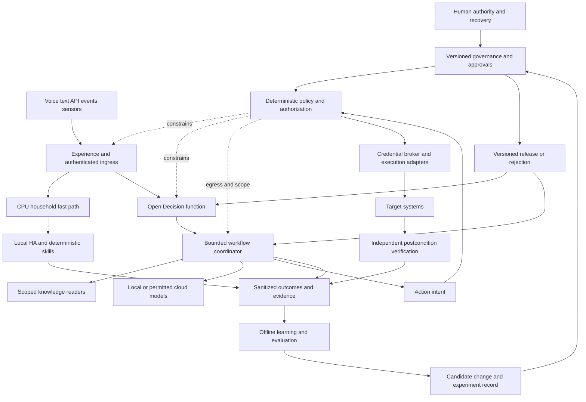
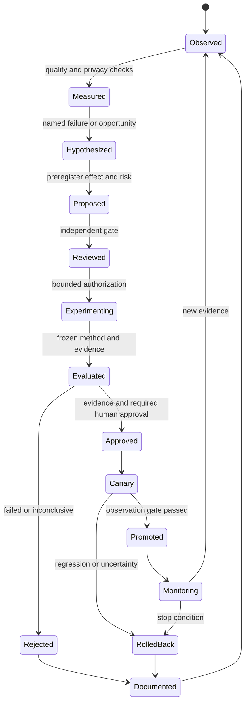

# Aster Adaptive Computing Programme — architectural assessment

**Decision: GO WITH RESTRUCTURING.** Assessment date: 25 September 2026. Owner of all proposed authority: Jason. This is an assessment, not implementation approval.

**Harness supplement:** [Current alternatives and measured selection plan](HARNESS-ALTERNATIVES.md). Hermes is a replaceable harness, not a programme dependency. Keep existing Aster as baseline; evaluate minimal Pydantic AI first and LangGraph for demonstrated durable workflow needs. No alternative has yet been benchmarked on this lab.

**Recommended single implementation document:** [Aster Adaptive Computing — Foundation and First Evidence Loop](Aster-Adaptive-Computing.md), now adopted by Jason as Stream A on 2026-09-25 at `docs/projects/AI Projects/Aster-Adaptive-Computing.md`. The project governs current authorization; this assessment remains dated evidence with bounded milestones and a finite graduation gate.

## 1. Executive conclusion

An overarching programme is feasible and justified. A single application, universal agent, shared credential pool, or indiscriminately merged knowledge base is not. Consolidate governance, contracts, evidence, portfolio management and operational explanations. Federate execution, identities, private data, recovery and deployment. Call the programme **Aster Adaptive Computing Programme**; keep Aster as the coherent assistant identity and architecture interface, with replaceable implementations behind it.

The strongest existing architecture is already visible: deterministic, source-local reports; bounded tools; local inference; explicit approvals; narrow execution; independent outcome checks; reproducible knowledge sources; and recorded graduation evidence. Preserve it. The weakest proposed direction would replace these boundaries with a more capable agent that controls its own permissions, evaluator and production changes.

The Decision Plane is useful as a **contract and replaceable decision function**. There is not yet evidence that it deserves a separately deployed service, a serial six-model ladder, or a sophisticated learned router. The Learning Plane is useful immediately as an **evaluation and change-evidence discipline**. Continuous training, reinforcement learning and automatic architectural evolution are not yet justified. Start with a static baseline, one challenger and a frozen evaluation corpus. A result showing that static rules are superior is programme success.

Material restructuring is required:

1. Preserve a CPU-capable household path independent of Hermes, the GPU, cloud inference and learning services. Existing sophisticated chat latency is not an acceptable light-switch dependency.
2. Treat Aster/Hermes/model judgments as proposals. Deterministic policy and human authorization remain outside their authority.
3. Repair and verify the broker boundaries described below before broadening agents or connecting consequential writes.
4. Keep private personal reasoning separate from public web research. The gala/calendar example exceeds the currently paused Personal Assistant scope; it needs an explicit, narrow composition design.
5. Consolidate overlapping plans into modules, retaining their historical records and unrelated infrastructure projects.
6. Measure task outcomes and retained complexity, not just classifier accuracy or model enthusiasm.

This is a GO for a read-only routing/evidence experiment and common architecture. It is **not** a GO for expanded privileges, automatic security changes, wholesale repository migration or production autonomy.

## Evidence conventions and scope

Throughout this assessment:

| Label | Meaning |
|---|---|
| VERIFIED CURRENT STATE | Direct read-only observation during this assessment, or inspected code at an identified revision; code presence is not proof every path is deployed or exercised. |
| REPOSITORY INTENT | A plan, implementation claim, historical test or graduation record in the repository. Historical successful tests are not current availability measurements. |
| ARCHITECTURAL INFERENCE | A conclusion drawn from stated evidence, with its limits. |
| PROPOSAL | A recommended design or requirement; not deployed and not approved by this assessment. |
| EXPERIMENTAL HYPOTHESIS | A falsifiable claim requiring evaluation. |
| UNKNOWN | Insufficient evidence; requires verification rather than invented state. |

All target architecture, thresholds and roadmap requirements below are **PROPOSAL** unless explicitly labeled otherwise. External documentation demonstrates supported concepts, not suitability or performance on this lab. Vendor performance claims were not accepted as lab measurements.

The evidence baseline is Forgejo main **e50b670b906f397e1e70b6d51cf07e88235ac5c5**, also verified at GitHub by a read-only remote ref query. The local main checkout at **586457f** was 15 commits behind. The cached GitHub ref was older; that was not a mirror outage. Non-secret documentation and relevant source were copied to this assessment bundle with [per-file hashes](evidence/source-manifest.json). Existing dirty files and all repositories were preserved. The [research log](research-log.md), [inventory](INVENTORY.md), copied source and isolated broker probes are part of this assessment.

Broad discovery covered tracked project, reference, governance, infrastructure, source and Git-history evidence, plus the reference/wiki siblings. Core architecture and security paths received detailed review; peripheral projects were reviewed for their purpose, status, design, dependencies, evidence and close-out. This is not a line-by-line audit of every implementation or a full live infrastructure/security audit. Unknowns are not graduation gates silently treated as passed.

## 2. Current-state findings

The [project inventory](INVENTORY.md) supplies the project-by-project purpose, implementation evidence, dependencies, overlap/conflict and disposition. Important current findings follow.

### Verified substrate

Read-only observations found Proxmox 9.2.20, a Xeon E5-2698 v4 with 20 cores/40 threads, 80,338 MiB host memory, 47,248 MiB available at one instant, and zero swap used. Running guest configured memory limits total approximately **73 GiB**, leaving only about **5.5 GiB** against host RAM before host requirements. Available memory is not an additional 46 GiB commitment budget.

Running guests include Docker 100, UniFi 101, Aster 104, Authentik 106, reverse proxy 107, Forgejo 108, observability 109, GPU inference 110, NetBox 111, backup relay 112, wiki 113, news 114, Paperless 115, speech 116 and OpenBao 117. Frigate VM 102 and Home Assistant VM 103 were running; old Ollama VM 105 was stopped. LXC 110 has 4 vCPUs and 16 GiB assigned, and Intel B60 devices bound to `xe`. Aster 104 has 2 vCPUs and 4 GiB. These observations do not establish sustained headroom or worst-case contention.

`aster-agent`, the access broker, approval service and Forgejo MCP gateway were active on 104; `aster-llama` was active and Ollama inactive on 110; speech was active on 116; OpenBao **2.6.3** was active on 117 with swap disabled for the service; Prometheus and Grafana were active on 109. The inspected Hermes gateway was inactive, with no matching loaded Hermes units returned. This does not prove no alternative user-level or ad hoc Hermes process exists.

**ARCHITECTURAL INFERENCE:** use existing CPU capacity for a small bounded routing experiment. Do not buy machines or add another GPU for the architecture diagram. Before deployment, measure host pressure, inference queueing, speech latency and backup/overnight contention. Most functions share one Proxmox host: component degradation is achievable; appliance availability during host failure is not currently demonstrated. Keep the independent UPS/NUT recovery role independent. Second-host resilience remains a separate decision.

### Implemented intelligence is narrower than the conceptual story

The inspected Aster harness preselects permitted tools deterministically and then performs bounded model reasoning. It does not require an unconstrained agent loop. The repository records historical read-only graduation suites and directory-retrieval experiments. Aster code and `lab_operations.py` hashes matched the reviewed revision on the live guest. The older Hermes work recorded substantial prompt/tool overhead and poor latency, leading to the lightweight Aster path. Reintroducing Hermes as mandatory operational brain would reverse a measured decision without new evidence. [Aster operations](https://github.com/elliottrook/homelab/blob/e50b670b906f397e1e70b6d51cf07e88235ac5c5/docs/reference/Aster-Operations.md); [Hermes history](https://github.com/elliottrook/homelab/blob/e50b670b906f397e1e70b6d51cf07e88235ac5c5/docs/reference/AI-Hermes-Second-Brain.md); [Second Brain](https://github.com/elliottrook/homelab/blob/e50b670b906f397e1e70b6d51cf07e88235ac5c5/docs/projects/completed%20projects/Aster-Sysadmin-Second-Brain.md).

The local serving path is llama.cpp rather than the old Ollama deployment. The repository records a Qwen model, a single 8K serving slot, B60 constraints and later serving upgrades; old unit/doc version strings are not a trustworthy current binary manifest. Exact serving build and all effective model settings remain **UNKNOWN pending a versioned runtime manifest**. A desktop client's larger advertised context is not proof that the server supports it. Historical reasoning latencies of tens of seconds are suitable evidence for deliberative workloads, not household control SLOs. [Local AI](https://github.com/elliottrook/homelab/blob/e50b670b906f397e1e70b6d51cf07e88235ac5c5/docs/projects/completed%20projects/Local-AI.md).

### AI-PAM is real but not fully graduated

The current project records M0–M5 completion and a connected Green Forgejo read pilot. Yellow write/native-client parity and final graduation gates remain incomplete. Broker registries and lifecycle machinery already exist; six new registry servers would duplicate that foundation. Human-held Shamir custody, AppRole use and scoped execution are valuable. However a short-lived OpenBao token retrieving a stored Forgejo PAT does **not** turn that PAT into a short-lived target credential. [AI-PAM project](https://github.com/elliottrook/homelab/blob/e50b670b906f397e1e70b6d51cf07e88235ac5c5/docs/projects/homelab-credential-broker.md); [OpenBao lease semantics](https://openbao.org/docs/concepts/lease/).

Two isolated synthetic tests against the reviewed broker code returned unexpected authorization success:

| Finding | Evidence and limit | Required gate |
|---|---|---|
| A registered caller can consume another agent's request if it has the ID and matching payload | `request.consume` authenticates a socket caller but does not bind that caller to the request's stored agent. Synthetic test consumed it. The inspected live service has the same relevant logic; its hash difference was a descriptive docstring. Not a demonstrated remote exploit. | Bind consume to authenticated originating principal/agent, not a caller-supplied identity; negative cross-agent tests. |
| An approved Yellow request survives demotion to probation | Synthetic store test consumed it after demotion. The live core hash matches reviewed code. Suspension/retirement revocation does not establish demotion safety. | Re-evaluate current agent state, capability, policy and revocation at consume; invalidate affected outstanding grants. |

The existing 36 broker tests passed in the isolated copy. Passing them did not cover these boundaries. See [test results](evidence/broker-probe-results.json), [probe code](evidence/probe_broker_boundaries.py), [core](https://github.com/elliottrook/homelab/blob/e50b670b906f397e1e70b6d51cf07e88235ac5c5/ops/credential-broker/broker_core.py) and [live transport copy](evidence/live-broker_service.py). No production request was created or consumed for these probes.

Additional review requirements are **not established exploits**: approval service trusts the Aster process to supply authenticated actor/assurance metadata; inspect explicit approver entitlement before multi-user enrollment; use atomic claim/consume with concurrency tests; bind target-state checks to execution; test policy changes and expiry races. Aster's HTTP layer validates an identity token, but application authentication alone is not proof of a distinct authorization-to-approve role. Keep model-facing processes out of the approval trust base wherever practicable. Current same-guest UID separation is useful but does not eliminate shared-kernel/root compromise.

### Conflicts requiring explicit reconciliation

| Conflict | Assessment |
|---|---|
| Old checkout describes early AI-PAM; remote main records deployed broker/OpenBao | Use pinned main and direct observations. Preserve early text as history, replace ambiguous current summaries later. |
| Older voice plan says speech unavailable and routes broadly through an LLM | Speech 116 is active. Adopt an independent deterministic household path. Full Alexa replacement remains unverified. |
| Portfolio and project status differ for Mac administration | Distinguish accepted milestone, deployed service, remaining publication and portfolio status. |
| Personal Assistant close-out language says not started while M0 has completed | M0 investigated; implementation remains paused. Do not infer calendar/email capabilities exist. |
| Reference sibling contains older NetBox authority statements | Main records later adoption. Pin source versions and valid dates; do not silently overwrite historical evidence. |
| ARR fixture graduation vs real execution | First-repair fixtures passed; no qualifying natural candidate was available and broker was disabled in recorded follow-up. Do not label live remediation proven. |
| Lab Operations bounded pilot vs universal infrastructure automation | Existing queue and Mac worker cover specific jobs; broad restores/pruning/admin actions remain excluded. |
| Octelium/Jev conceptual inclusion | No deployment evidence found in scoped searches. UNKNOWN, not verified installed or absent. |

## 3. Architectural synthesis and evolution

The body of work implies five durable patterns: a source owns its facts; readers export constrained observations; reasoning proposes; bounded executors act only under explicit authority; evidence determines graduation. This is already a system-of-systems foundation.

The history is a sequence of narrowing and verification rather than straightforward growth:

| Evolution | Evidence retained | Architectural lesson |
|---|---|---|
| Local AI/Hermes to lightweight Aster, late August | Large tool schemas and loop latency; bounded Aster implementation | Harness replaceability matters more than an agent brand. |
| Second Brain graduation in early September | Repeated source-aware answer tests | Knowledge quality depends on provenance and retrieval, not memory volume. |
| Wiki, expanded corpus and directory-first retrieval | Source manifests, deterministic rebuilds, repeated evaluation | This is an existing small Learning Plane precedent. |
| Read-only HA/ARR/Forgejo/NetBox reports | Schema-constrained producers and freshness limits | Constrained observations are safer than blanket source credentials. |
| Companion and Lab Operations | Authenticated interface, bounded queue, durable result states | User experience and execution can evolve separately. |
| AI-PAM through current main | Custody, broker identity, approval, probation, initial integration | Common authorization is emerging; legacy action adapters still need integration. |
| Personal Assistant M0 | Explicit iCloud scope limitation and separated private/public workers | Personalization cannot reuse infrastructure trust boundaries indiscriminately. |

Repeated problems were solved differently: approval/candidate lifetimes in ARR, job envelopes in Lab Operations, and broker grants in AI-PAM; authentication and principal naming across Companion and broker; model endpoints and scheduling in news, documents and assistant; source authority across wiki/reference/mirror; independent status/evidence sections that become stale. Consolidate the contracts and shared libraries, **not** target-specific safety predicates or private datasets.

Retain source-local reports, strict schema validation, candidate binding, uncertain-outcome states, one-job limits, explicit manifests, per-consumer identities and tested recovery. Retire as defaults: LLM on every request; Hermes by mandate; conversational memory as evidence; runtime capability discovery as permission grant; a shared admin credential for agents; an embedding score labeled calibrated confidence; “completed project” as current availability proof; and repeated new project documents for what is actually a module change.

The [project charter](https://github.com/elliottrook/homelab/blob/e50b670b906f397e1e70b6d51cf07e88235ac5c5/docs/Project-Creation-Standard.md) is fundamentally compatible. Proposed additions: programme/module ownership; contract compatibility gates; a mandatory experiment record for claimed optimization; evidence validity dates; separate observation from intervention; evaluator independence; a deployment manifest spanning repositories; and an explicit standing-authorization envelope for any future automatic Class 1 promotion. Current remote-write and stop-condition rules continue to apply. Do not silently reinterpret Stream A as perpetual autonomous architectural authority.

## 4. Target architecture

### Logical boundaries

The proposed stacked planes incorrectly suggest that policy comes after model selection and that learning is another synchronous hop. Policy constrains ingress, retrieval, egress, planning and every effect. Learning is a separately owned subsystem and a cross-cutting, slower control loop. Knowledge is multiple stores with different authorities, not a universal final layer.



Aster is the interface and reviewing role, not the root of authority. Hermes can be one constrained worker if it beats the current harness on the relevant workload. The workflow coordinator owns deadlines, cancellation, state and budgets; individual models do not own credential grants. Specialist agents are useful only when their narrow data/tool scope provides a measurable boundary or quality advantage.

### Trust and data boundaries

| Boundary | Allowed flow | Required control |
|---|---|---|
| Household room/device to ingress | Speech/text and device context | Device identity is not human identity; unauthenticated voice gets only explicitly allowed household actions. |
| Ingress to decision | Minimum request features and scoped context handles | Authenticated principal comes from transport/session, not prompt text. |
| Public web to reasoning | Untrusted retrieved facts with source/time | No approval instructions, credential requests or tool authority accepted from content. |
| Private readers to local reasoning | Authorized principal's scoped facts | Enforce subject isolation before retrieval; prohibit cross-person caches. |
| Local to cloud | Only explicitly exportable features/content | Deterministic egress policy, redaction, provider allowlist and budget. |
| Plan to authority | Typed action intent, exact target and parameters | Policy re-evaluation, approval binding, credential brokerage and adapter constraints. |
| Runtime to learning | Sanitized observations and permitted labels | Separate retention/consent classes; no credentials; no raw hidden reasoning. |
| Learning to production | Reviewed, versioned release candidate | Frozen evaluator, signed approval where required, rollback and observation window. |

### Information, control and failure paths

“Turn off kitchen lights”: local speech → deterministic supported intent → existing HA authorization → HA service → state confirmation. No GPU, Hermes, cloud or learning dependency. Ambiguous device names ask a question; locks, safety devices and security-sensitive controls are not implicitly included.

“When was Star Wars released?”: identify which work if ambiguous; local factual capability or small model with an appropriate uncertainty response. Do not fabricate certainty merely to avoid web cost. Freshness-sensitive questions use an approved retrieval route.

“Can I attend the gala advertised at west.com given my meeting?”: classify CALENDAR + WEB + REASONING, possibly LOCATION, with private data prohibited from cloud by default. Public worker fetches the user-supplied public page without calendar access; validates/sanitizes an event factcard including date, time zone, venue and retrieval time. A private local reader supplies free/busy and authorized travel constraints. A local reasoning step joins them. Missing date/location asks Jason. Do not send personal meeting details back to a web search to refine the result without a new, permitted information-flow decision. This is a proposed amendment to the [paused PA boundaries](https://github.com/elliottrook/homelab/blob/e50b670b906f397e1e70b6d51cf07e88235ac5c5/docs/projects/Aster-Personal-Assistant.md), not an existing feature.

Failure of the sophisticated route returns a clear partial result, offers deterministic capabilities and preserves queued job status. Failure of Learning never blocks a light switch. Failure of identity/custody blocks new privileged grants; it does not require disabling already provisioned, narrowly scoped local HA automation. No admin fail-open path is created under the name of graceful degradation.

## 5. Learning Plane design

### Purpose and storage

The Learning Plane produces **evidence-backed change proposals**, not permissions. Its first implementation can be a local evaluation runner, versioned manifests and an append-only event database, using existing monitoring. No new cluster, feature store, vector database or always-running training system is required.

Keep four kinds of state distinct:

1. **Runtime observations:** structured events and traces, local storage, bounded retention; no default raw prompts.
2. **Curated datasets:** consented, labeled examples with provenance, versions and deletion lineage; encrypted storage outside Git for sensitive examples.
3. **Evidence artifacts:** benchmark outputs, aggregate metrics, experiment manifests, confidence intervals and release provenance.
4. **Durable decisions:** ADRs and experiment summaries in Git, containing sanitized conclusions and references, not private traces or secrets. GitHub mirroring makes this distinction essential.

Source-local redaction uses allowlisted fields, not only a blacklist. Classifiers may need short raw input transiently; persistence is a separate decision. Embeddings, entity IDs, timestamps and feature combinations can remain identifying. De-identification is risk reduction, not proof of anonymity. Avoid stable plaintext hashes of low-entropy personal content; use scoped keyed pseudonyms where linking is justified. Never retain passwords, tokens, private keys, approval secrets or secret-bearing tool arguments as training examples.

**Proposed default retention:** raw content zero durable retention unless explicitly opted in; temporary debugging examples at most 24 hours; sanitized detailed outcomes 90 days; aggregate trends one year; sanitized decisions and manifests retained with architectural history. Curated personal examples need separate opt-in, purpose and review/deletion date. Existing PA retention decisions (raw 24 hours, summaries 15 days, research 60 days, selective backup exclusion) are not superseded. These new defaults require approval before collection.

### Telemetry contract

Every significant request gets a random correlation ID. Emit separate decision, authorization, execution and verification events, joined by ID. Fields include:

| Group | Fields |
|---|---|
| Provenance | schema version, observed time, producer, deployment digest, policy/registry/router/model/prompt/skill versions, experiment assignment |
| Input abstraction | modality, principal pseudonym where permitted, sensitivity, consent class, intent features, context source IDs/versions/freshness, no default content |
| Decision | candidate routes, chosen capabilities and DAG, reason codes, rejected alternatives, score type, calibrated probability if valid, abstention/escalation reason |
| Resources | queue/decision/model/tool/total latency, CPU/GPU time where available, token counts, bytes egress, priced cost and price version, unknown cost explicitly null |
| Authority | requested capability, policy verdict and reason, approval reference, grant expiry, denial, revocation, never credential values |
| Execution | attempt count, idempotency key, start/end status, timeout/cancellation/uncertain outcome, bounded error class |
| Verification | expected postcondition, source-local before/after state references and freshness, independently observed result, rollback/incident references |
| Feedback | human correction and provenance, opt-in satisfaction, label quality, disagreement, missing-feedback marker |

Do not equate HTTP 200, model completion, absence of complaint or policy ALLOW with user success. Separate route correctness, answer quality, authorized execution, target outcome and user satisfaction. A blocked unsafe request can be a policy success and an incomplete user task. False positives/negatives require an adjudicated reference; they cannot be inferred from counts alone.

### Evidence lifecycle and state machine



Each transition records actor, timestamp, exact input artifacts, policy version and reason. Proposal authors cannot edit the locked evaluator or retroactively change a success threshold. An inconclusive experiment is not promotion evidence. Rejected hypotheses remain searchable to avoid repeatedly rediscovering attractive failures.

An experiment record must contain: ID/owner; problem and hypothesis; baseline; candidate digest; affected population and exclusions; metrics and units; minimum useful improvement; noninferiority guardrails; dataset provenance/splits; test and statistical method; compute/data budget; intervention class; approval; stop conditions; rollback; observation window; results including adverse effects; decision; deployment linkage; and continuing-monitoring responsibility.

### Datasets, labels and personalization

Build a multi-label taxonomy around required capabilities, not a single mutually exclusive intent. Labels include required/optional/prohibited capabilities, acceptable model tiers, locality constraints, freshness needs, ambiguity, authorized action type and required confirmation. “CALENDAR” alone is insufficient ground truth for a web/calendar question.

Distinguish human-verified gold, source-verified outcomes, weak inferred labels, model suggestions and synthetic examples. Model output is not its own ground truth. Preserve conflicting annotations and adjudication rather than majority-voting engines into truth. In the example disagreement, record each engine/version and raw score, then Jason's correction CALENDAR + WEB as the adjudicated routing label; retain whether PERSONAL_CONTEXT was actually necessary separately.

Split by incident/session/template family and time so paraphrases and later corrections do not leak across train, calibration and locked test sets. Keep a temporal holdout and a difficult minority-intent set. Training examples may be updated; evaluation versions are immutable snapshots. Removal/consent withdrawal propagates to derived datasets and schedules affected-model review or retraining where applicable; Git should contain manifests, not undeletable personal data.

Use active learning to select uncertain, novel or disagreeing examples for a small review budget. Also sample ordinary successful-looking requests, otherwise the corpus overrepresents failures. Synthetic augmentation tests coverage and robustness but is reported separately from independent real interactions. Personal preferences such as “bedtime means these lights” become explicit editable facts/rules with owner and scope, not opaque model habits.

### Calibration and abstention

Define the probability's event: e.g. “all required capabilities identified and no prohibited capability selected for this supported task class.” A cosine score, model self-report or provider probability is not automatically that probability.

Use a disjoint calibration set. For binary correctness scores, compare sigmoid/Platt scaling and isotonic regression; use temperature scaling where meaningful logits are available. Do not apply temperature scaling to arbitrary natural-language confidence. Small samples make flexible isotonic fitting unstable; select using held-out performance. Preserve the calibrator version and its supported population. [Calibration methods](https://scikit-learn.org/stable/modules/calibration.html); [temperature-scaling research](https://proceedings.mlr.press/v70/guo17a.html).

Report reliability diagrams by intent/risk/locality where sample sizes permit: among cases with predictions near 0.9, what fraction met the specified correctness event? Include bin counts and uncertainty. Report expected calibration error with binning stated, plus Brier score/log loss where appropriate; no single metric proves calibration. Rare classes need wider intervals, not confidently displayed decimals. For multi-label outputs evaluate individual labels and complete-plan correctness separately.

Choose abstention by **selective risk versus coverage**, not maximum average accuracy. Thresholds differ by consequence; router confidence never authorizes privileged action. An out-of-distribution flag, inadequate calibration support, ambiguity, unhealthy dependencies or policy conflict can force abstention regardless of score. Track useful clarification and safe abstention as successful decisions; measure excessive abstention as a usability cost.

### Experiments and causal limits

| Experiment | What it can establish | What it cannot establish alone |
|---|---|---|
| Shadow classification | Paired route disagreements, latency, calibration | Counterfactual execution success or actual cloud savings |
| Historical replay | Reproducible performance on a fixed corpus | Current distribution or historical private-state truth unless captured lawfully |
| Model/prompt benchmark | Comparative quality under frozen context/tool fixtures | Safety of newly granted real tools |
| Randomized read-only A/B | Outcome differences in eligible populations | Safety of excluded high-risk populations |
| Remediation simulation | Preconditions, allowed effects and rollback behavior | Natural incident success and unknown environmental side effects |
| Canary | Bounded live effects and operational contention | Rare catastrophe probability from a small sample |

Preregister the primary endpoint and a minimum useful effect. Use paired comparisons when cases are shared, block bootstrap by independent session/family for correlated observations, and intervals suitable to binary rates. Report missing labels and exclusions. Control repeated peeking and multiple candidate selection; reserve a final untouched holdout. Do not retrospectively pick the winning metric. Sequential monitoring needs a prespecified stopping rule.

For perspective, zero failures in 300 independent representative trials only gives a rough 95% upper failure-rate bound of 1%, not proof of safety at one-in-a-million frequency. Correlated paraphrases reduce effective evidence. Security invariants therefore require enforcement and adversarial tests, not merely favorable outcome statistics.

### Drift, promotion and rollback

Monitor input mix, score distribution, abstention, slice-specific error, postcondition failure, cost and resource contention. Distribution shift is a trigger to investigate, not proof of quality regression. Compare rolling production windows against a versioned baseline and periodically relabel a sampled set. Missing feedback is tracked as missing.

Promote an immutable bundle: router/rules/model/prompt/calibrator/registry references plus policy compatibility and dataset/evaluator IDs. Deploy by pinned digest with a last-known-good pointer, staged exposure and finite observation window. Rollback reverts the bundle and invalidates incompatible pending plans/grants. It cannot undo an external action; action-specific compensation and manual recovery remain separate. Retain rejected and rolled-back versions with reason and impacted request IDs.

Prevent reward hacking by keeping evaluator custody and success criteria outside proposer control; independent outcome verification; gold labels not generated by the tested model; random audits; locked holdouts; disclosure of synthetic/weak labels; rate-limited candidate generation; one material change at a time; promotion hysteresis; and a complexity budget. Permission changes never emerge from a model optimizer. A learned router that improves averages while harming a sensitive minority slice fails promotion.

## 6. Open Decision Plane

### Stable contract

Use versioned JSON Schema first, implemented as an in-process library or local endpoint as needed. An illustrative contract:

```json
{
  "schema_version": "decision.v1",
  "request_id": "opaque-id",
  "input": {"modality": "text", "content_handle": "local-scoped-handle"},
  "principal_context_ref": "trusted-ingress-context",
  "constraints": {"egress": "local-only", "deadline_ms": 1500, "max_cost": 0},
  "registry_version": "sha256:...",
  "policy_snapshot": "sha256:..."
}
```

```json
{
  "schema_version": "decision.v1",
  "request_id": "opaque-id",
  "status": "plan",
  "capabilities": ["calendar.free_busy", "web.public_event", "reason.local"],
  "sensitivity": "personal",
  "plan": [
    {"id": "public", "capability": "web.public_event", "after": []},
    {"id": "private", "capability": "calendar.free_busy", "after": []},
    {"id": "join", "capability": "reason.local", "after": ["public", "private"]}
  ],
  "confidence": {"event": "complete_capability_set", "probability": null, "calibrator": null},
  "reason_codes": ["EXPLICIT_PUBLIC_URL", "PERSONAL_CALENDAR_REQUIRED", "LOCAL_ONLY_JOIN"],
  "authorization": "not_granted",
  "expires_at": "timestamp",
  "engine_version": "rules:revision"
}
```

Other statuses: `clarify`, `abstain`, `unsupported`, `degraded`, `deny`. Distinguish deadline exhaustion from no eligible capability. The validated principal context is not a client-controlled string in the actual implementation. Plans contain typed parameter bindings, context access requirements and maximum steps, not executable shell text. Validate acyclic composition, total deadline/cost, compatible schemas and data-flow labels. Bound fan-out, retries and depth. Reject unknown schema versions and unknown capabilities for execution.

A plan is never an access token. The executor rechecks identity, capabilities, health, policy, resource bounds and approval before each step. Registry or policy changes invalidate stale plans as necessary. The Decision API is stable; engine-specific scores and embeddings remain adapter internals.

### Routing structure

Do not force `rules → semantic → classifier → local LLM → frontier → human` on every request. That stacks latency and error, and assumes cloud is more appropriate than clarification. Use a budgeted decision graph:

1. Apply trusted identity, privacy, allowed capability and resource constraints.
2. Match precise deterministic household/operational intents, with explicit ambiguity handling.
3. For unresolved eligible requests, select **one** cheap classifier/semantic route using the benchmark winner. Semantic routing and an embedding classifier may be competing implementations, not mandatory consecutive stages.
4. Use a local language model for composition or ambiguity only if its incremental quality justifies latency.
5. Ask a human immediately for missing intent, identity or authorization. Use frontier reasoning only where export is allowed and expected benefit warrants cost. Cloud is not the default cure for uncertainty.

Hard constraints define the feasible set first: privacy, identity, policy, locality, available resources and deadlines. Within it optimize task success, latency, cost and reliability, using measured conditional performance rather than a universal model rank. A weighted objective may be useful inside an approved feasible set; privacy and a deterministic DENY are never tradable weights. Prefer Pareto comparisons until workload data supports numerical weights.

### Engines and replacement path

Rules are the baseline; Aurelio or a small embedding classifier is the first plausible challenger. SetFit becomes useful with enough labeled personal examples. A local small model is conditional on actual CPU/model availability, not presumed cheapness. The existing larger local model can serve bounded reasoning experiments, with strict queue isolation from household speech.

Jev provides a potentially useful constrained decision adapter, but its probability must be calibrated on the relevant task and its data handling must be acceptable. Keep input/output behind the same contract, enforce outbound minimization, timeouts and a kill switch, and test only approved synthetic/exportable cases until retention and privacy terms are verified. Never make Jev a credential or approval authority. Local rules remain the immediate fallback and a local classifier the replacement candidate. [Jev documentation](https://www.jevai.org/docs).

## 7. Registries without duplication

Use a single versioned **catalogue model** with related records and generated views, not six independent truth stores. Reuse AI-PAM's authoritative identity/capability permission records. Runtime health and performance are observations, not mutable declarations of entitlement.

| Record/view | Owns | Does not own |
|---|---|---|
| Capability | Stable semantic ID, purpose, input/output schema, determinism, side effects, sensitivity envelope, locality, dependencies, required permission references, owner | Actual permission grant or self-reported trust |
| Skill implementation | Capability implementation version, artifact, adapter, parameter limits, test suite, timeout/idempotency/compensation contract | Duplicate capability vocabulary |
| Model | Exact artifact/provider/version, location, context limits verified per serving configuration, tool/structured-output tests, benchmark links, privacy boundary, price version | Universal “best model” label |
| Agent | Workload identity, owner, allowed capability references, probation/state, deployment digest, revocation state | Privileges inferred from model performance |
| Policy | Authoritative rules/bundles, schema, authorizer, approval provenance and effective dates | Policy generated and activated by model judgment |
| Experiment | Preregistered hypothesis, versions, datasets, metrics, results, decision and follow-up | Runtime authority |

Keep static catalogue manifests in Git where non-secret, broker-authoritative grants in its controlled store, and health/latency/success estimates in a separately timestamped observation view. Generate the Decision Plane's authorized capability projection for each principal; never expose all capabilities and ask the model to self-police. Distinguish declaration, verification and observation. A provider's advertised context or an agent's claimed skill is unverified until checked.

Record sample size, task slice, age and uncertainty with reliability estimates; no naked success percentages. Cache only policy-valid filtered catalogues, with expiry and revocation strategy. Signed or integrity-checked release manifests prevent unreviewed registry entries from silently becoming executable tools. Unknown owner or missing authorization contract means non-executable.

## 8. Security and governance

Improve the proposed chain to:

**Trusted ingress identifies → deterministic policy limits information and capabilities → intelligence proposes → deterministic policy authorizes the exact intent → broker supplies scoped execution authority → adapter acts → independent verifier checks → audit records.**

The early policy gate is essential: classification itself can leak a private request if it calls an external engine. A later DENY cannot retract that disclosure. Retrieved documents, sensor events and MCP results are untrusted data, not new user instructions. Models cannot select their own trusted principal, approval assurance or policy version.

### Authority and credentials

Use separate human, device, service, agent and experiment identities. A device in the kitchen is not Jason; a Jason-authenticated application user is not automatically an infrastructure approver. Authentik supplies authentication and attributes; the authorization layer interprets explicitly allowed roles and context. PKCE protects a flow but is not a tool permission model. [Authentik OAuth/OIDC documentation](https://docs.goauthentik.io/add-secure-apps/providers/oauth2/).

OpenBao owns secret custody; adapters own source-specific credential use. Prefer secretless request brokerage: the model sees a capability result, never a credential. Native dynamically scoped credentials are preferred when the target supports them. Otherwise document static-token scope and lifetime, rotation, compensating controls and revocation tests. Avoid confusing broker-session expiry with downstream-token expiry. Do not read custody stores into prompts, logs, traces or datasets.

Enforce at the tool/adapter boundary, not merely at the prompt or UI. Authorizations bind authenticated principal, agent identity/version, capability, canonical parameters, target, policy version, sensitivity, approval actor/assurance, expiry and single-use nonce. Include target-state or candidate version for state-sensitive actions. Recheck at execution; atomically claim grants; reject changed arguments, wrong caller, demoted/revoked agent, expired approval, changed policy and stale target. Failures with uncertain external outcome require reconciliation, not blind retries.

Preserve ARR's specific candidate predicate and Lab Operations' bounded job allowlist when integrating common authorization. Replacing them with generic `shell.execute` or “approved agent” would be a regression. Existing Mac-worker credential custody is an interim exception, not proof AI-PAM covers all execution. [Lab Operations](https://github.com/elliottrook/homelab/blob/e50b670b906f397e1e70b6d51cf07e88235ac5c5/docs/projects/Aster-Lab-Operations.md); [ARR first repair](https://github.com/elliottrook/homelab/blob/e50b670b906f397e1e70b6d51cf07e88235ac5c5/docs/projects/Aster-ARR-First-Repair-Decision.md).

Maintain network segmentation and explicit service-to-service paths. Octelium could replace parts of access infrastructure, but adding it alongside Tailscale, NPM, Cloudflare access and Authentik without a migration decision would create overlapping authorities. Its documented policy enforcement is relevant, not evidence that it is installed or needed here. Defer adoption to a separate bounded access-plane comparison. [Octelium policy architecture](https://octelium.com/docs/octelium/latest/management/core/policy).

### Probation and separation of duties

New model/agent state: **registered → shadow → restricted pilot → approved scope → suspended/retired**. Promotion requires workload evidence, contract tests, data-flow review, explicit human-approved capability changes and revocation tests. Model quality may justify a proposal for broader scope; it never grants that scope. Capability discovery only returns existing entitlements. Pin model/tool artifacts and verify provenance before onboarding; a new weight file or tool version is a new evaluation subject.

Separate proposer, evaluator, authorizer, executor and verifier by process/identity where the risk warrants it. Jason may fill multiple human review roles, but a single model process must not be able to modify all five. Start with distinct directories, write permissions and service identities; a diagram alone is not independence. For higher-risk agents, use a stronger isolation boundary than shared UID-separated code on the inference guest. A compromised Proxmox root remains a shared trust risk and must be handled through recovery and independent evidence, not magical in-host isolation claims.

### Change classes

These classes govern *changes to the system*. Existing Green/Yellow/Red/Black capability execution classes continue independently. Select the stricter of change class, data sensitivity, blast radius, target reversibility and existing repository authorization. “Read-only” does not make private-data export low risk.

| Class | Scope | Evidence and tests | Review/approval and promotion | Rollback/audit |
|---|---|---|---|---|
| 0 — observe | Existing authorized non-sensitive measurements, offline synthetic evaluation | Schema/privacy checks; prove no effectful calls | Named owner and existing collection authorization; no privilege or retention expansion | Stop collector; delete disallowed data; record dataset/collector versions |
| 1 — reversible optimization | Prompt/router/model selection within unchanged tools, privacy and resource envelope | Frozen paired benchmark, slice guardrails, compatibility, last-known-good test; live canary if applicable | Initial human approval; later automatic promotion only under a specific standing envelope, frozen evaluator and finite scope | Atomic bundle revert, observation window, signed/provenance-linked decision; stop on unknown |
| 2 — guarded operational | A bounded service action/remediation with real effects | Preconditions, simulation, adverse cases, independent postcondition, tested compensation/restore, natural pilot | Explicit existing Stream M/A authority for exact action; human approval by default; standing bounded operations only if separately authorized | Action-specific compensation, rate limits, circuit breaker; cannot assume configuration revert undoes effects |
| 3 — architecture/security | Trust boundaries, permissions, custody, identity, policy meaning, evaluation criteria, interfaces affecting consumers | Threat model, negative authorization tests, migration compatibility, failure/restore drill, measured necessity | Jason's explicit review and approval; AI cannot auto-promote | Versioned policy migration, revoke stale grants, recovery plan; independent audit copy |
| 4 — irreversible/high impact | Destruction, last recovery copy, broad exposure, major migration | Full dependency/risk assessment, verified recovery where possible, rehearsal, explicit accepted residual risk | Fresh exact human approval; never delegated by a Class 1 optimizer | Recovery/compensation stated honestly; irreversible effects cannot have fictitious rollback |
| Prohibited | Silent privilege expansion, bypass approvals, weaken safety to improve metrics, expose secrets | Not an experiment | Deny; a model recommendation cannot override | Incident handling and revocation |

No class grants permission to push, merge, publish or modify remote workflows contrary to current repository rules. Automatic local optimization is not automatic Git publication. Any future release automation needs its own explicit authorization mechanism rather than a reinterpretation of this assessment.

### Emergency controls and recovery

Provide independent controls for global effectful-action disable, per-agent revoke, per-capability disable, cloud egress disable and experiment freeze. Broker revocation must invalidate pending/approved requests and be checked at execution. Stop commands should be accessible through a human administrative path that does not depend on the failing agent. A stop signal cannot un-send an already dispatched request; reconcile in-flight actions and verify targets.

Document break-glass access, custody/unseal ceremony, dependency startup order and out-of-band console access. Preserve ordinary physical controls. Do not make Companion notifications the only way to learn that the host running Companion has failed. Recovery credentials remain outside AI custody; break-glass use is human, time-bounded and audited.

## 9. Observability and operational explanation

Reuse Prometheus/Grafana and Lab Doctor. Use OpenTelemetry-compatible trace IDs and spans for request flow, but pin the chosen schema: GenAI semantic conventions evolve, and sensitive payload collection must be explicitly disabled. Prometheus stores low-cardinality aggregate metrics, not per-request records or personal labels. [OTel GenAI conventions](https://opentelemetry.io/docs/specs/semconv/gen-ai/); [Prometheus label guidance](https://prometheus.io/docs/practices/naming/).

| Dashboard question | Metric/denominator and caveat |
|---|---|
| Resolved locally? | Verified successful requests with no cloud content transfer / all eligible completed requests; also report unknown/incomplete. Separate predicted local eligibility from actual execution. |
| Frontier invocation? | Requests with frontier calls / all requests, by intent and reason; include denied/failed attempts separately. |
| Misroutes? | Adjudicated false positives, false negatives, exact capability-set accuracy and confusion by intent; show labeling coverage. |
| Cost increasing? | Actual metered cost by route/model plus estimation status; local resource seconds/energy if measured, not fictional zero-cost compute. |
| Failing skills? | Verified failure rate by skill version and task class, retry/timeout/uncertain rates, volume and interval. |
| Jason's corrections? | Consented, pseudonymized correction categories with counts; no calendar/email content in labels. |
| Remediation success? | Verified intended postcondition and no identified collateral incident / eligible attempts; retain rollback and uncertainty counts. |
| Update regression? | Paired holdout results and controlled production slices linked to release digest; distinguish workload shift. |
| Dependency growth? | Observed service edges and critical-path depth; declarative dependency review; missing-trace uncertainty. |
| Abstention quality? | Coverage, selective error, useful clarifications, repeated unresolved requests and user abandonment if measurable. |
| Outage functionality? | Scripted dependency-failure drill results by household capability; not uptime inferred from process health. |
| Privacy correctness? | Blocked exports, permitted exports by class/provider, invariant violations, audit coverage; zero alerts is not proof of zero leakage. |
| Architectural improvement? | Experiment-to-release ledger showing prespecified metric change, intervals, costs, observation window and surviving rollback checks. |

Operational explanation should read: “Matched calendar and public-event requirements; private context forced local reasoning; public page fetched without calendar data; cloud route rejected by policy; selected local model version X; result verified/uncertain.” It should expose reason codes, relevant versions and alternatives without hidden chain-of-thought or secret policy data.

**Proposed initial service objectives, to be validated rather than claimed:** deterministic text routing p95 below 100 ms on the lab CPU; local household control acknowledgment within 1 second after transcript availability; voice end-to-end measured separately for wake, transcription, intent, action and audio; deliberative tasks immediately acknowledge with bounded deadlines and visible queued state. Alarm/timer delivery has its own durable scheduler and timing objective, not the chat latency objective. Availability targets should follow baseline measurement and host-resilience decisions; do not assert household-appliance availability from a single active-service check.

Use local bounded spooling if the telemetry collector fails. Privileged writes that require durable audit fail closed when their audit record cannot be persisted. Deterministic household controls may continue with bounded local audit under explicit policy. Alert on spool saturation and lost observations so the Learning Plane does not silently learn from a biased subset.

## 10. Failure-mode analysis

| Failure | Required degraded behavior | Test and unresolved risk |
|---|---|---|
| Internet outage | Local HA, deterministic controls, local speech/models and timers continue where their media/data are local; mark web/calendar-sync freshness | Disconnect WAN in a bounded future drill; cloud media catalogs, remote authentication dependencies and Apple push will not be guaranteed. |
| Jev unavailable/disappears | Adapter timeout/circuit breaker; local rules/classifier or clarification | Inject failure; no plan may require vendor availability or vendor-specific schema. |
| Cloud model unavailable | Eligible local substitute or honest partial/abstain | Test failure, quota and excessive latency; never export to a new provider automatically. |
| GPU failure | CPU household path continues; deliberation queues or abstains | Disable inference endpoint in simulation first; speech currently separate but CPU contention still matters. |
| Local LLM failure | Same fast path; only permitted cloud fallback | Malformed output, OOM and invalid schema are failures, not permission to run unvalidated plans. |
| Hermes failure | No baseline dependency; replace worker or pause its jobs | Current inspected Aster path already independent of inactive Hermes gateway. Test any future integration. |
| Decision function failure | Explicit allowlisted deterministic commands and clarification | Corrupt config/timeout tests; no fallback to unrestricted model tools. |
| Authentik failure | No new privileged logins/approvals; only explicitly valid bounded existing sessions; independent human recovery | Test cache expiry, clock and revocation behavior. Local preauthorized HA automation need not depend on new identity grants. |
| OpenBao sealed/unavailable | No new secret retrieval; pause affected jobs; human unseal/recovery | Test target token expiry/revocation and restore; never add plaintext fallback credentials. |
| Broker/policy failure | Privileged execution denied; household existing isolated controls remain | Test stale cached policy and emergency stop; no “AI says safe” bypass. |
| Monitoring failure | Local bounded spool and independent alert; freeze evidence-based promotion | Durable-audit-required actions stop if audit unavailable. Missing metrics cannot become success evidence. |
| Corrupt learning data | Quarantine dataset/version; freeze promotion; retain last-known-good runtime | Checksums, schema and lineage validation; restore dataset manifests; identify affected releases. |
| Bad model update | Pin old artifact, revoke candidate, drain/cancel safely | Benchmark plus canary; changed tool-call behavior requires reevaluation even if model name unchanged. |
| Bad routing update | Revert complete routing/calibration/catalogue bundle | Test backwards compatibility and in-flight plans; sensitive misroute triggers immediate halt, not prolonged A/B. |
| Feedback poisoning | Reject unauthenticated labels, quarantine anomalies, human adjudication | Provenance tests, adversarial examples; no automatic training on external text or model self-praise. |
| Accidental privilege escalation | Deterministic deny, revoke agent/grants, incident review | Cross-agent consume, demotion, changed policy, stale approval and concurrency tests are required gates. |
| Storage full/clock jump | Bound queues; persist timer intent; no duplicate effectful retries | Wall-clock plus monotonic timing design; reboot/time-change tests; fail closed on uncertain approval validity. |
| Shared Proxmox host fails | Physical controls and independent human recovery; dependent digital services unavailable | Current architecture cannot promise digital assistant continuity; separate resilience project required. |

Basic music means only supported local playback with locally available media/authentication. “Internet-independent music” cannot promise a streaming provider's catalog. Durable timers/alarms require local scheduling, reboot semantics, audible endpoint behavior and time-change tests; Apple Web Push is not the alarm delivery foundation. Native HA local voice options support a useful starting point, but restricted-vocabulary speech has task limitations and must be tested against actual timer and household phrasing. [Home Assistant local voice](https://www.home-assistant.io/voice_control/voice_remote_local_assistant/).

## 11. Consolidation plan — no moves authorized yet

Use a **programme overlay in the existing HomeLab repository**, preserving service/module boundaries and the authority roles of sibling repositories. Do not begin by creating another repository that duplicates all the current ones. One programme does not require one Git repository for sensitive data, runtime state, knowledge and infrastructure.

Proposed future structure, after review:

```text
docs/programmes/aster/
  charter.md                 # scope, ownership, non-goals, authority
  architecture.md            # current logical architecture, not milestone history
  portfolio.md               # module status and dependencies
  contracts/                 # explanations and compatibility policy
  decisions/                 # ADRs, including rejected alternatives
  experiments/               # sanitized preregistration/results
  evidence-index.md          # pointers and verification dates
schemas/aster/
  decision/ capability/ outcome/ experiment/ authorization-intent/
catalogues/aster/
  capabilities/ skills/ models/ agents/  # non-secret declarations
services/aster-agent/         # existing runtime; do not move merely for symmetry
ops/credential-broker/        # authority component, separately reviewed
evals/aster/
  synthetic/ manifests/ metrics/        # no raw personal content
experiments/aster/
  <experiment-id>/            # non-production, no production credentials
```

`homelab-reference` remains curated operational facts; `homelab-wiki` remains human-readable offline knowledge; the derived Aster mirror remains reproducible, non-authoritative retrieval material. Verify live mirror placement rather than recreating it because a local sibling is missing. A deployment manifest pins relevant commits across repositories and records generation inputs. Do not claim cross-repository updates are atomic; use compatible staged changes and an explicit consistent manifest.

Migration map:

| Existing family | Programme destination | Preserve separately |
|---|---|---|
| Second Brain, wiki, corpus and retrieval projects | Knowledge module and source-authority contract | Original evaluation logs and adoption history |
| Local AI, Hermes experiments, serving upgrades | Model-serving module and model registry | Hardware/driver experiments and failed options |
| Companion and voice plan | Experience module with household reliability submodule | Device/client-specific implementation and security |
| HA/ARR/Forgejo/NetBox read-only advisers | Domain capability adapters | Source-specific report schemas and scope |
| ARR repair, Lab Operations, AI-PAM | Common authorization/intent/outcome contracts | Independent executor safety predicates and custody |
| Email/calendar/morning digest plans | Paused Personal Assistant module | Explicit supersession links and privacy decisions |
| News/Paperless/media recommenders | Consumers of common model/evidence contracts | Distinct content stores, scheduling, retention and product goals |
| Monitoring, backups, network, identity, resilience | Shared platform dependencies | Their independent operational ownership and recovery |

Archive only after source/consumer references, status and evidence are reconciled. First mark superseded pages with explicit successor links; later use Git-aware moves, preserving history and redirects/index pointers. No squashing, history rewrite or document concatenation. Retain rejected projects as decisions. Keep live operational procedures separate from immutable project history to stop “current state” paragraphs becoming ambiguous.

Ownership: Jason owns programme policy, privacy, priorities and promotion authority; each module declares a human accountable owner (initially Jason) and a replaceable automation maintainer; Aster may draft/review; deterministic executors own no policy. Every contract has an owner, supported major versions and deprecation plan. Experimental modules cannot become runtime dependencies without a graduation decision. Bound complexity by counting deployed services, required dependencies, administrative burden and failure paths in every adoption experiment.

## 12. Phased roadmap

The gates below authorize no deployment by themselves. Read-only experiments may progress while security remediation is planned; privileged integrations may not bypass the security gate.

| Phase | Goal and dependencies | Acceptance and measurement | Risks, rollback and evidence to proceed |
|---|---|---|---|
| 0 — establish trustworthy baseline | Reconcile pinned repository/live state; identify owners, exact builds and open gates | Current-state manifest; full dependency map; broker caller/demotion fixes designed and later independently tested; list unknowns | Risk: stale records masquerade as reality. No runtime change during assessment. Proceed with source hashes, explicit open risks and approved bounded implementation scope. |
| 1 — minimal contracts and corpus | Stable Decision/outcome schemas; catalogue projection; existing rules baseline | Versioned synthetic corpus, contract validation, zero secret fields, reproducible baseline; CPU/memory/latency measured | Risk: overengineering. Keep implementation in-process and fixtures local; remove candidate library. Proceed only if baseline and labels are usable. |
| 2 — offline challenger experiment | Phase 1; one CPU semantic/classifier option; existing local model optional | Preregistered comparison, exact-set and per-label metrics, calibration/coverage, resource cost; decision to retain rules or improve | Risk: tiny biased corpus. No execution or personal export; discard challenger. Proceed only on meaningful gain or a clearly identified next test, not aesthetic preference. |
| 3 — bounded real shadow observations | Approved retention/consent; telemetry filters; security gates for any broker connection | Two or more representative usage windows, labeled sample coverage, no authority change, measured background overhead and disagreement | Risk: private-data retention/host contention. Disable shadow/spool, delete disallowed data. Proceed with audited minimization and real distribution evidence. |
| 4 — one evidence-backed improvement | Phase 3 identifies a concrete recurring failure/cost | One prompt/rule/threshold/model change passes frozen holdout, slice guardrails, canary and continued observation | Risk: feedback contamination. Revert entire bundle. Proceed only when improvement survives an observation window and maintenance cost is acceptable. |
| 5 — bounded composition | Approved private/public data-flow design; reliable workflow state and contract tests | Calendar/web synthetic → consented read-only live pilot; independent fetch/join; deadline, cancellation and privacy tests | Risk: personal-context exfiltration and stale data. Disable new DAG, retain prior PA boundaries. Proceed with explicit scope amendment and verified isolation. |
| 6 — limited automatic optimization | Several successful manually governed releases; standing Class 1 authorization; evaluator independence | Automated candidate can promote only within fixed tools/privacy/policy envelope; tested emergency freeze/revert; no evaluator edits | Risk: metric gaming/drift. Revoke automation and restore last-known-good. Proceed only if reduced human effort exceeds new operational burden. |
| 7 — guarded operational autonomy | AI-PAM graduation, exact action safety cases, restore drills, natural incident evidence | One narrowly defined remediation with caps, cooldown, approval policy, independent postcondition and rollback; tested uncertainty handling | Risk: harmful effects and permission creep. Stop/revoke/reconcile. Expand only through a new human-reviewed capability decision. |

A separate resilience workstream measures shared-host and notification failures, then decides whether existing hardware can provide an independent minimal assistant/alert path. Hardware purchase is contingent on those measured needs, not on completing the Learning Plane.

Stop conditions: no measurable benefit after two well-designed challenger iterations; unusable labels at sustainable review effort; significant privacy uncertainty; uncontrolled background compute contention; evaluator/proposer inability to separate; or operational burden exceeding savings. In those cases keep the common contracts, static routing and periodic manual evaluation. The programme remains valuable without learned routing or automatic promotion.

## 13. Minimum viable experiment

**Question:** does a replaceable learned decision function improve multi-capability routing enough to justify its latency, review and maintenance costs over the current deterministic baseline?

**Hypothesis H1:** a CPU-capable semantic/classifier challenger improves complete capability-set correctness on mixed and ambiguous requests while meeting unchanged privacy/authorization rules and acceptable latency. **H0:** rules with a small number of explicit additions are equally good or better. Neither result grants production execution.

### Corpus and arms

Create approximately **300 independently authored cases**, initially synthetic and human-labeled: 30 each across timers, HA controls, media, general knowledge, calendar, web, mixed calendar/web, personal context, sysadmin and ambiguous/unsupported requests. This is a pilot sizing proposal, not a power calculation or guarantee. Include paraphrases, but group them as families; do not count each as independent evidence. Include unsafe device targets, missing identity, ambiguous dates, conflicting context, untrusted retrieved instructions and unavailable dependencies. Balance deliberately for diagnosis, then separately weight by measured real workload when available.

Split by family into development, calibration and locked test partitions, with enough samples per reported category; if bins are too sparse, report uncertainty and gather more rather than fitting elaborate calibration. Human labels record required/optional/prohibited capabilities, locality, permitted data flow, ambiguity, acceptable alternatives and whether clarification is the correct outcome. A second review pass catches inconsistent labels; hard disagreements stay unresolved until adjudicated.

Arms: A, existing deterministic routing under a contract adapter; B, a simple improved rules baseline to avoid attributing easy rule fixes to ML; C, one locally available embedding/semantic implementation; D, existing local LLM for a bounded subset if resource budget permits. SetFit is a subsequent contender when labels support training. Jev is an optional additional arm only with exportable synthetic data and reviewed terms. No new major dependency is installed merely to make the benchmark impressive.

All arms see equivalent eligible information, registry and policy constraints. Run repeated timings under controlled warm/cold conditions and record load; model quality sampling is distinct from timing repetitions. Disable actual calendar, HA, sysadmin and web execution. Use fixed capability fixtures and instrument an execution sink that rejects all effects. Engine disagreement is stored without declaring a winner until comparison to labels.

### Measures and provisional gates

| Measure | Definition/gate |
|---|---|
| Correctness | Exact required capability set, allowed alternatives, per-label precision/recall, intent macro averages; report ambiguous-case clarification separately |
| Safety/privacy | Zero prohibited plan/egress in the adversarial suite; deterministic enforcement still required regardless of this finite test |
| Calibration | Reliability bins/counts, Brier/ECE where valid, task-specific probability event and selective risk/coverage |
| Latency | p50/p95 routing time, cold/warm split, total CPU/GPU resource use; provisional CPU routing p95 <100 ms excluding speech and model answering |
| Locality | Fraction *eligible for local execution*, not observed completed-local rate; actual completion measured only in later phase |
| Cloud | Candidate cloud requirement/invocations under permitted synthetic evaluation; estimated versus metered cost separated |
| Disagreement/abstention | Pairwise disagreement matrix, error intersection, useful clarification, over-escalation and coverage |
| Complexity | New runtime services/dependencies, setup/review minutes, memory footprint, explanation completeness and replacement effort |

Before looking at locked results, choose a meaningful improvement such as at least five percentage points on the targeted mixed/ambiguous subset, with no unacceptable degradation elsewhere, and specify uncertainty/noninferiority margins appropriate to sample size. This example threshold is **not yet approved or statistically powered**. An inconclusive small test motivates more cases, not promotion. Keep rules if C only ties B at greater cost. Stronger-model escalation must improve observed outcomes on its eligible slice enough to justify cost; merely classifying more cases is insufficient.

Deliverable: one reproducible experiment bundle, frozen labels, engine/configuration digests, metrics and intervals, disagreements, false-positive/negative examples stripped of sensitive content, risk review and ADR choosing rules, challenger, further study or rejection. No live task execution and no authority change are needed to prove the architecture's first useful claim.

## 14. Evidence-backed change standard

**Proposed normative standard ECS-1.** “MUST” below describes the recommended future standard; it does not retroactively approve changes.

Every change claiming improvement MUST identify its owner, class, affected contracts/data/identities, immutable baseline and candidate, falsifiable hypothesis, minimum useful effect, metrics, guardrails, dataset/evaluator provenance, test method, budget, approval, rollback and observation window. It MUST preserve adverse results and uncertainty. It MUST distinguish offline proxy improvement from verified live outcome improvement. No LLM recommendation alone constitutes evidence.

The evaluator and promotion criteria MUST be frozen before the decisive evaluation. Candidate authors MUST NOT alter held-out labels, delete unfavorable cases or change the primary endpoint after seeing results. Necessary corrections create a new experiment version with the reason recorded. Security policy, permissions and evaluation rules cannot be changed under a prompt/routing optimization label. A change's consequences determine its class.

| Change | Minimum specific evidence | Promotion limitation |
|---|---|---|
| Prompt/tool description | Paired frozen task set; source-grounded factual checks; tool/structured-output tests; injection and relevant failure cases; latency/token comparison | Same tools, data and authority only; no hidden behavior expansion; canary if serving users |
| Routing rule | Positive/negative and overlapping-intent fixtures; multi-label coverage; ambiguity/abstention tests; privacy and dependency constraints | No new capability grant; regressions in critical slices block promotion |
| Model selection/version | Exact serving artifact/config; task-specific quality; context/structured-output/tool reliability; resource contention; provider privacy/cost review | No automatic cloud substitute for local-only; old model retained until rollback verified |
| Confidence threshold/calibrator | Disjoint calibration and held-out sets; supported task population; reliability and selective risk/coverage with uncertainty | No uncalibrated scalar as authorization; insufficient labels means abstain or keep old threshold |
| Skill boundary/merge/split | Consumer/dependency analysis, input/output compatibility, principal/data isolation, failure and rollback behavior, measured duplication/quality benefit | Architecture review if trust boundaries change; fewer files alone is not benefit |
| Permission/agent scope | Explicit necessity, threat model, least-privilege alternatives, negative cross-identity tests, revocation/demotion/expiry/concurrency tests, exact human approval | Never automatically promoted from performance evidence; all privilege expansion Class 3 or higher |
| Architecture/interface | ADR comparing simpler/adopted options; dependency/failure model; reproducible pilot; migration/compatibility/restore evidence; measured operational burden | Human authorization; long-lived conclusions remain revisitable; no “elegance” acceptance criterion |

Statistical evidence MUST match the consequence and decision. Use independent sampling units, report intervals and absolute effects, and avoid interpreting absence of observed harm as proof of safety. Low-volume high-impact actions require stronger deterministic controls and human review, not weaker evidence standards because data are scarce. A permission regression fails regardless of average quality gain. Cost reductions must include retries, escalations and maintenance effort, not only token price.

Promotion MUST identify exact deployed versions, approval provenance, canary population, start/end observation dates, rollback trigger and responsible reviewer. A release is not established until it survives the stated window. Rollback or incidents reopen the decision. Emergency rollback may occur under a preauthorized narrower scope; it cannot silently introduce broader access or retain unsafe old credentials.

Record rationale as operational facts: matched capability, constraints, alternatives, measured results and decision. Hidden model chain-of-thought is neither required nor a reliable audit object.

## 15. Build versus adopt and final decision

### What existing systems could replace

The [harness supplement](HARNESS-ALTERNATIVES.md) expands and refines the orchestration comparison below, distinguishing minimal agent libraries, durable workflows and complete assistant products. Its initial shortlist is existing Aster, minimal Pydantic AI and selective LangGraph; Pi is a conditional alternative. Framework selection is an experiment gate, not a predetermined migration.

| Category / candidates | Useful replacement scope | Boundary and decision |
|---|---|---|
| vLLM Semantic Router | Substantial model-routing, signal composition, backend selection and associated monitoring functionality | Serious adopt candidate if routing becomes complex; Envoy/deployment/configuration burden may exceed household need. Benchmark before adoption; does not replace credential authority or outcome governance. [Official repository](https://github.com/vllm-project/semantic-router). |
| Aurelio Semantic Router; embedding classifier; SetFit | Replace custom intent-classification machinery | Best small challenger category; multi-capability labels and calibration still required. Start with one. [Aurelio](https://docs.aurelio.ai/docs/semantic-router/user-guide/guides/semantic-router); [SetFit](https://huggingface.co/docs/setfit/main/index). |
| Jev | Optional typed external decision engine | Replaceable adapter only; retention, price and local-workload calibration require verification. No unique internal contract. [Docs](https://www.jevai.org/docs). |
| LiteLLM; RouteLLM | Provider/model routing, fallback/cost mechanisms; learned strong/weak model selection | Useful if many providers become operational burden. RouteLLM's model preference task is not a capability graph or security policy. Avoid a proxy until needed. [LiteLLM routing](https://github.com/BerriAI/litellm-docs/blob/main/docs/routing.md); [RouteLLM](https://github.com/lm-sys/RouteLLM). |
| LangGraph; Hermes | Agent/workflow reasoning harness and worker implementation | May replace custom orchestration, not authorization. Hermes must beat Aster's measured baseline; LangGraph adds useful stateful graph primitives if composition warrants them. [LangGraph](https://docs.langchain.com/oss/python/langgraph/overview); [Hermes](https://github.com/NousResearch/hermes-agent). |
| Temporal | Durable long-running workflow execution/history | Adopt when recovery/timer/workflow complexity exceeds current SQLite/systemd jobs; external actions still need idempotency and reconciliation. Do not install to run the routing experiment. [Workflow documentation](https://docs.temporal.io/workflows). |
| OPA or Cedar | Deterministic authorization policy evaluation | Either could replace ad hoc rule evaluation while keeping broker enforcement; choose one only after policy complexity and tests justify it. Simple explicit policy may suffice initially. [OPA](https://www.openpolicyagent.org/docs); [Cedar](https://docs.cedarpolicy.com/). |
| OpenBao, Authentik, existing network controls; Octelium | Existing custody/authentication foundation; possible future consolidated access layer | Retain current adopted components. Octelium is a separate migration option with overlap, not another required plane. [Octelium overview](https://octelium.com/docs/octelium/latest/overview/intro). |
| Promptfoo; MLflow; Phoenix | Evaluation runner; datasets/experiments/model lifecycle; traces/evaluation | Start with local runner/fixtures, consider Promptfoo. Select at most one larger platform when manual evidence management becomes a measured problem. Preserve exportable schemas. [Promptfoo](https://www.promptfoo.dev/docs/intro/); [MLflow datasets](https://mlflow.org/docs/latest/genai/datasets/); [Phoenix](https://arize.com/docs/phoenix/). |
| Langfuse | Integrated LLM traces/evaluations | Worth comparing later; self-hosting introduces multiple storage/runtime components. Not justified alongside every other platform. Review optional cloud judges and payload retention in any choice. [Self-hosting](https://langfuse.com/self-hosting). |
| Prometheus/Grafana + OTel | Metrics/dashboard foundation and distributed tracing | Reuse existing deployment; add minimal sanitized traces, not a parallel observability stack. [OTel](https://opentelemetry.io/docs/specs/semconv/gen-ai/). |
| llama.cpp; Ollama | Local model serving | Retain working llama.cpp/B60 path; Ollama is an interchangeable serving choice if a future benchmark supports it. No replatforming merely to match the conceptual list. [llama.cpp](https://github.com/ggml-org/llama.cpp). |
| Haystack; existing wiki/mirror | Retrieval pipeline and knowledge preparation | Existing provenance-aware mirror is valuable. Adopt a retrieval framework only for demonstrated retrieval/maintenance needs; do not introduce vector memory as default authority. [Haystack](https://github.com/deepset-ai/haystack). |
| MLflow model registry; Feast | Model lifecycle metadata; feature serving | A Git catalogue and observed-performance table suffice initially. Feast is unnecessary for hundreds of household examples; MLflow becomes relevant at larger experiment volume. [Model registry](https://mlflow.org/docs/latest/ml/model-registry/); [Feast](https://docs.feast.dev/). |
| DSPy; contextual bandits/Vowpal Wabbit | Offline prompt candidates; adaptive selection under partial feedback | Defer live learning. Optimizers need trustworthy fixed metrics; bandits require careful exploration and propensity logging. Neither learns permission. [DSPy optimizer docs](https://github.com/stanfordnlp/dspy/blob/main/docs/docs/learn/optimization/optimizers.md); [VW tutorial](https://vowpalwabbit.org/docs/vowpal_wabbit/python/latest/tutorials/python_Contextual_bandits_and_Vowpal_Wabbit.html). |

Build only the HomeLab-specific contracts, policy integration, source/target adapters, evidence lifecycle and ownership conventions that existing tools do not supply. Adopt commodity execution/observability/evaluation capabilities when their operational benefit is demonstrated. Keep adapters thin, portable artifacts and contract conformance tests so adopting a framework does not make its internal object model the programme's public architecture.

### Attempts to disprove the proposal

**Are we reinventing a platform?** Partly. Mature routers, workflow systems, evaluators and policy engines already cover substantial implementation. Building replacements for all of them would be unjustified. None of the reviewed systems establishes this lab's human authorization, appliance fallback, data ownership and evidence thresholds automatically. The programme's value is integration and governance, not inventing every plane.

**Is a Decision Plane unnecessary?** A standalone service probably is at this stage. A stable decision contract is useful even if the implementation is a dozen rules. If rules win the experiment, retain them. Multi-capability composition still needs an explicit plan representation.

**Is the Learning Plane feasible?** Versioned evidence, offline evaluation and human-reviewed changes are feasible now and have a local precedent. Reliable automated improvement of broad personal-assistant answers is much harder: sparse labels, subjective satisfaction and missing counterfactuals limit what can be learned. Restrict early learning to routing, retrieval, prompt regressions and bounded action outcomes.

**Could self-improvement cost more than it saves?** Yes. Continuous optimization, multiple registry/evaluation services and background agent debates could consume the lab's compute and Jason's review attention without better outcomes. Track maintenance time and dependency growth; stop at periodic manual evaluation if that wins.

**What remains deliberately non-learning?** Authorization semantics, credential custody, principal isolation, approval requirements, emergency stop, audit integrity, source-of-truth rules, destructive-action prohibitions and deterministic household safety constraints. Learning may propose changes; humans review them under Class 3/4. Their runtime authority remains deterministic.

**Where is automation unacceptable now?** Unbounded shell administration, autonomous permission expansion, unsupervised private-to-public context composition, irreversible data changes, generalized remediation without natural outcome evidence, or automatic release while evaluator/approval boundaries are weak.

### Final decision

**GO WITH RESTRUCTURING.** Evidence supports one coherent programme with stable contracts, bounded modules and a separately governed empirical control loop. Existing read-only adapters, local serving, identity/custody, bounded jobs and retrieval experiments provide credible foundations. Evidence does not support making Hermes mandatory, treating AI-PAM as fully graduated, merging private/public workers, promising host-independent availability, or allowing automatic architectural/security promotion.

Proceed first with the minimal read-only routing comparison, state reconciliation and security-boundary remediation plan. A successful first milestone is a reproducible decision about whether a learned router is worth having—including a decision to keep static rules. Aster should evolve when measured improvement survives review and continued observation; the system must remain fully capable of rejecting an elegant but unsupported idea.
