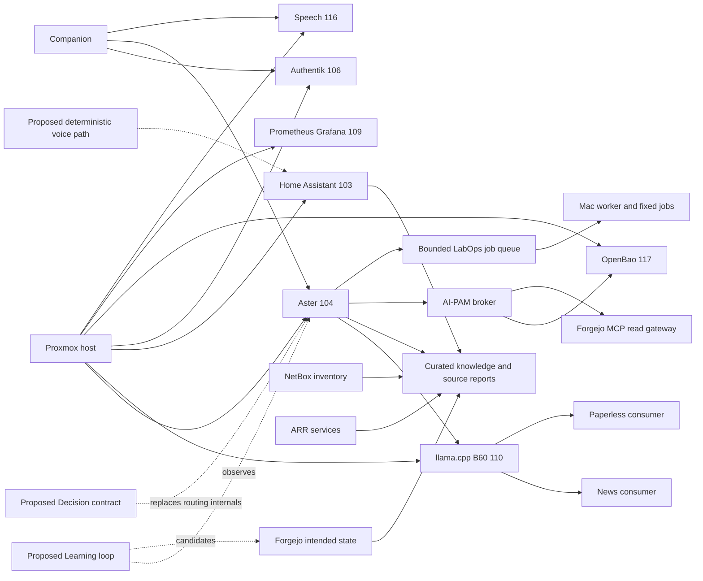

# Current-state inventory and proposed disposition

Assessment baseline: main `e50b670b906f397e1e70b6d51cf07e88235ac5c5`, 25 September 2026. All dispositions are **PROPOSAL**, not migration authorization. “Recorded implemented/completed” means **REPOSITORY INTENT / historical implementation evidence**, not fresh end-to-end verification. “Live” is used only for the narrow observations described in the assessment. Unknown means no sufficient evidence, not proven absence.

Disposition vocabulary: **retain** existing bounded component; **absorb** programme-level planning/contract overlap; **refactor** a demonstrated boundary/duplication problem; **supersede** replace current guidance while preserving history; **archive** keep historical record outside active backlog; **verify** resolve evidence gaps first. Multiple dispositions apply to different aspects of a project.

## Assistant, model, knowledge and execution projects

| Project / evidence | Purpose and status / implementation | Dependencies | Overlap or conflict | Recommended disposition |
|---|---|---|---|---|
| [Local AI](https://github.com/elliottrook/homelab/blob/e50b670b906f397e1e70b6d51cf07e88235ac5c5/docs/projects/completed%20projects/Local-AI.md) | Recorded completed local inference pilot; llama service live on 110, old Ollama service inactive and VM105 stopped | B60, Proxmox, model artifacts, serving configuration | Old Ollama and serving/version/context descriptions differ from newer evidence | Retain model-serving module; absorb new model experiments into registry/evidence; verify exact live build |
| [Hermes / Second Brain reference](https://github.com/elliottrook/homelab/blob/e50b670b906f397e1e70b6d51cf07e88235ac5c5/docs/reference/AI-Hermes-Second-Brain.md) | Historical Hermes orchestration and measured limitations; inspected gateway inactive | Local model, tools, knowledge | Conceptual “operational brain” conflicts with actual Aster replacement and measured overhead | Retain historical comparison; optional probationary worker; supersede mandatory-Hermes premise |
| [Aster Sysadmin Second Brain](https://github.com/elliottrook/homelab/blob/e50b670b906f397e1e70b6d51cf07e88235ac5c5/docs/projects/completed%20projects/Aster-Sysadmin-Second-Brain.md) | Recorded graduated read-only advisor; Aster runtime active and key code hashes matched | Source reports, curated knowledge, local serving | Same learning/evaluation principles recur in later projects | Retain service; absorb programme planning into knowledge/reasoning modules; preserve test history |
| [Offline Knowledge Wiki](https://github.com/elliottrook/homelab/blob/e50b670b906f397e1e70b6d51cf07e88235ac5c5/docs/projects/completed%20projects/Aster-Offline-Knowledge-Wiki.md) | Recorded completed offline human knowledge service; wiki guest running | Forgejo snapshots, wiki pipeline, source ownership | Human wiki and machine mirror are different products, not duplicate authorities | Retain; unify source manifests and canonical links |
| [Production Corpus Expansion](https://github.com/elliottrook/homelab/blob/e50b670b906f397e1e70b6d51cf07e88235ac5c5/docs/projects/completed%20projects/Aster-Production-Corpus-Expansion.md) | Recorded completed expanded curated corpus and evaluations | Source register, wiki/reference, retrieval | Repeated project for knowledge-module release | Absorb active maintenance into knowledge module; archive completed project as evidence |
| [Mirror Directory Retrieval](https://github.com/elliottrook/homelab/blob/e50b670b906f397e1e70b6d51cf07e88235ac5c5/docs/projects/completed%20projects/Aster-Mirror-Directory-Retrieval.md) | Recorded completed directory-first retrieval, repeated benchmark and fallback | Derived mirror, manifests, retrieval code | Best existing precedent for evidence-backed optimization; no general autonomous learning proven | Retain implementation and experiment record; absorb future work into module |
| [Aster Home Assistant](https://github.com/elliottrook/homelab/blob/e50b670b906f397e1e70b6d51cf07e88235ac5c5/docs/projects/completed%20projects/Aster-Home-Assistant.md) | Recorded graduated read-only HA advisor with report/evaluation contract | HA report producer, bounded Aster tool, local model | Not household-control execution or voice replacement | Retain read adapter; keep permissions separate from controls |
| [Forgejo / NetBox Read-Only](https://github.com/elliottrook/homelab/blob/e50b670b906f397e1e70b6d51cf07e88235ac5c5/docs/projects/completed%20projects/Aster-Forgejo-NetBox-Read-Only.md) | Recorded graduated sanitized reports | Source-local producers, source tokens retained locally, Aster | Later broker MCP live reads overlap but report contracts still valuable for low-risk observations | Retain reports; choose freshness/cost route explicitly; do not delete merely because MCP exists |
| [ARR Stack Manager](https://github.com/elliottrook/homelab/blob/e50b670b906f397e1e70b6d51cf07e88235ac5c5/docs/projects/completed%20projects/Aster-Arr-Stack-Manager.md) | Recorded graduated read advisor | ARR producers and schema, Aster | “Manager” name can imply authority it does not generally possess | Retain; clarify read-adviser capability names |
| [ARR Report Contract](https://github.com/elliottrook/homelab/blob/e50b670b906f397e1e70b6d51cf07e88235ac5c5/docs/projects/Aster-ARR-Report-Contract.md) | Implemented/recorded source-local sanitized report specification | ARR reader, freshness and schema validation | Cross-project outcome/source contract candidate | Retain domain schema; absorb common provenance conventions |
| [ARR First Repair](https://github.com/elliottrook/homelab/blob/e50b670b906f397e1e70b6d51cf07e88235ac5c5/docs/projects/Aster-ARR-First-Repair-Decision.md) | Bounded stale Radarr queue-item repair, fixture evidence; natural live case not proven | Candidate predicate, fresh state, short approval, fixed action | Separate approval design overlaps AI-PAM; deletion of queue item is still an effect | Retain target predicate; refactor envelope only after broker gates; verify live graduation |
| [Companion ARR Execution Follow-up](https://github.com/elliottrook/homelab/blob/e50b670b906f397e1e70b6d51cf07e88235ac5c5/docs/projects/Aster-Companion-ARR-Execution-Followup.md) | Proposed/remaining real execution validation; recorded disabled broker without natural candidate | Companion, ARR bounded action | Cannot call fixture completion production remediation success | Retain bounded backlog item under execution module; verify rather than archive as done |
| [Aster Companion App](https://github.com/elliottrook/homelab/blob/e50b670b906f397e1e70b6d51cf07e88235ac5c5/docs/projects/completed%20projects/Aster-Companion-App.md) | Recorded graduated native Mac / iPhone web interface, Authentik and speech; speech service live | Authentik, NPM/Tailscale, Aster, speech116, Apple push for applicable notifications | AI-PAM native parity still open; cloud push cannot be local alarm foundation | Retain experience module; absorb shared identity/outcome contracts |
| [Home Assistant Voice Assistant](https://github.com/elliottrook/homelab/blob/e50b670b906f397e1e70b6d51cf07e88235ac5c5/docs/projects/Home-Assistant-Voice-Assistant.md) | Proposed Alexa replacement; full implementation not demonstrated | HA, local speech, intent handling, media/device integration | Stale no-STT premise; broad LLM dependence conflicts with reliability requirement | Supersede architecture with CPU deterministic fast path; retain user requirements; verify device/audio capabilities |
| [Aster Personal Assistant](https://github.com/elliottrook/homelab/blob/e50b670b906f397e1e70b6d51cf07e88235ac5c5/docs/projects/Aster-Personal-Assistant.md) | M0 discovery complete, implementation paused; email/calendar integration not established | Isolated readers, per-principal context, Authentik, scheduling, model capacity | Current separation excludes unrestricted mixed private/web interaction; contradictory close-out label | Retain paused module and privacy decisions; refactor status; explicit scope amendment for live composition |
| [Email Triage Digest](https://github.com/elliottrook/homelab/blob/e50b670b906f397e1e70b6d51cf07e88235ac5c5/docs/projects/Email-Triage-Digest.md) | Never-started predecessor, superseded by PA | Email reader and private context | Duplicate active plan if left current | Supersede/archive with PA link |
| [Calendar Personal Assistant](https://github.com/elliottrook/homelab/blob/e50b670b906f397e1e70b6d51cf07e88235ac5c5/docs/projects/Calendar-Personal-Assistant.md) | Never-started predecessor, superseded by PA | Calendar reader | Duplicate PA scope | Supersede/archive with PA link |
| [Combined Morning Digest](https://github.com/elliottrook/homelab/blob/e50b670b906f397e1e70b6d51cf07e88235ac5c5/docs/projects/Combined-Morning-Digest.md) | Never-started predecessor, superseded by PA | Email/calendar/news composition | Duplicate orchestration/retention decisions | Supersede/archive; preserve why boundaries changed |
| [AI-PAM / Credential Broker](https://github.com/elliottrook/homelab/blob/e50b670b906f397e1e70b6d51cf07e88235ac5c5/docs/projects/homelab-credential-broker.md) | M0–M5 recorded complete, Green Forgejo read connected; broker/approval/MCP/OpenBao live; final graduation incomplete | Authentik, OpenBao117, UID identities, Forgejo integration | Legacy broker/executor overlaps; synthetic caller/demotion gaps found; old text stale | Retain authority module; fix/verify before expansion; reuse registries |
| [Lab Operations](https://github.com/elliottrook/homelab/blob/e50b670b906f397e1e70b6d51cf07e88235ac5c5/docs/projects/Aster-Lab-Operations.md) | Bounded deployed pilot with durable jobs/Mac worker and acceptance; broad recovery/publication gates remain | Doctor, backup scripts, approved guest allowlist, authenticated Companion, Mac credentials | Separate action envelope and interim credential custody; does not authorize generic sysadmin | Retain safe job constraints; refactor common envelope; verify restore and custody closure |

## Platform and access dependencies

| Project / evidence | Purpose and status / implementation | Dependencies | Overlap or conflict | Recommended disposition |
|---|---|---|---|---|
| [Authentik Rollout](https://github.com/elliottrook/homelab/blob/e50b670b906f397e1e70b6d51cf07e88235ac5c5/docs/projects/Authentik-Rollout.md) | Many integrations recorded; guest running; remaining administrative/final gates | NPM, identity providers, app entitlements, recovery accounts | Authentication is sometimes mistaken for approval entitlement | Retain independent identity platform; verify role/assurance mapping and recovery |
| [Media SSO Assessment](https://github.com/elliottrook/homelab/blob/e50b670b906f397e1e70b6d51cf07e88235ac5c5/docs/projects/Authentik-Media-SSO-Assessment.md) | Compatibility evaluation with deferred adoption choices | Jellyfin/Seerr/client versions, Authentik | Not all clients support desired unified login | Retain decision evidence; no forced SSO consolidation |
| [Cloudflare Access OIDC handover](https://github.com/elliottrook/homelab/blob/e50b670b906f397e1e70b6d51cf07e88235ac5c5/docs/handovers/Authentik-Cloudflare-Access-OIDC-Handover.md) | Recorded specific access integration | Cloudflare, Authentik, external access path | Does not imply public exposure appropriate for assistant/admin | Retain scoped perimeter record; verify each app separately |
| [Synology Drive Family Cloud](https://github.com/elliottrook/homelab/blob/e50b670b906f397e1e70b6d51cf07e88235ac5c5/docs/projects/completed%20projects/Synology-Drive-Family-Cloud.md) and [handover](https://github.com/elliottrook/homelab/blob/e50b670b906f397e1e70b6d51cf07e88235ac5c5/docs/handovers/Synology-Drive-Cloudflare-Handover.md) | Recorded family cloud access deployment | Synology, identity, Cloudflare access | Separate consumer/privacy boundary; not assistant storage by default | Retain independent service; do not merge credentials or data |
| Octelium | User's conceptual access-control candidate; no deployment evidence found | Would overlap access proxy/tunnel/policy roles | Risk of parallel authorities with existing controls | Verify any external/untracked work; evaluate as replacement option, not required addition |
| [Network / VLAN / current baseline](https://github.com/elliottrook/homelab/blob/e50b670b906f397e1e70b6d51cf07e88235ac5c5/docs/Current-Network-Baseline.md) | Recorded segmented network, Tailscale admin routes, private management | OPNsense, switches, DNS, NPM, Tailscale | Historical initial baseline and later amendments coexist; broad agent connectivity would conflict | Retain infrastructure authority; generate dated current summary from verified facts |
| [NetBox DCIM](https://github.com/elliottrook/homelab/blob/e50b670b906f397e1e70b6d51cf07e88235ac5c5/docs/projects/completed%20projects/NetBox-DCIM.md) | Recorded graduated inventory authority; guest running | Network inventory, operational workflows | Older reference sibling adoption status stale | Retain declared inventory authority; reconcile references |
| [Prometheus / Grafana](https://github.com/elliottrook/homelab/blob/e50b670b906f397e1e70b6d51cf07e88235ac5c5/docs/projects/completed%20projects/Prometheus-Grafana-Observability.md) | Recorded graduated observability; both services active | Exporters, alert routing, Authentik, protected state | Must complement rather than duplicate Doctor/Beszel | Retain; add low-cardinality assistant metrics incrementally |
| [Lab Doctor / drift / reports](https://github.com/elliottrook/homelab/blob/e50b670b906f397e1e70b6d51cf07e88235ac5c5/docs/04-Operations.md) | Recorded functional/drift checks and operational CLI; bounded Aster integration | Sanitized source checks, baseline files, backup freshness | A past “all passed” report is not current health; drift accept is effectful | Retain deterministic verifier; never let model silently accept its own drift |
| [Beszel](https://github.com/elliottrook/homelab/blob/e50b670b906f397e1e70b6d51cf07e88235ac5c5/docs/Current-Network-Baseline.md) | Recorded host/container history and sustained alerting on Docker host | Host agents, hub, private access | Overlapping metrics with Prometheus | Retain defined host-history role; deduplicate alert ownership |
| [Backup Architecture Redesign](https://github.com/elliottrook/homelab/blob/e50b670b906f397e1e70b6d51cf07e88235ac5c5/docs/projects/completed%20projects/Backup-Architecture-Redesign.md) | Recorded redesigned protected backup architecture | Relay112, TrueNAS/offsite paths, schedules, custody | Assistant/learning retention must not silently expand backup scope | Retain independent recovery system; add approved evidence-store recovery only |
| [Backup Synology Decommission](https://github.com/elliottrook/homelab/blob/e50b670b906f397e1e70b6d51cf07e88235ac5c5/docs/projects/completed%20projects/Backup-Synology-Decommission.md) | Recorded completed retirement of old backup role | Replacement backup coverage and evidence | Historical paths can mislead current recovery | Archive completed work with current successor/runbooks; preserve checks |
| [Media Archive Synology Backup](https://github.com/elliottrook/homelab/blob/e50b670b906f397e1e70b6d51cf07e88235ac5c5/docs/projects/completed%20projects/Media-Archive-Synology-Backup.md) | Declined plan, not implemented | Capacity and backup value assessment | “Completed projects” directory does not mean deployed | Retain rejection decision; exclude from implemented dependency map |
| [Infrastructure Resilience Hardening](https://github.com/elliottrook/homelab/blob/e50b670b906f397e1e70b6d51cf07e88235ac5c5/docs/projects/Infrastructure-Resilience-Hardening.md) | Approved direction; second-node work deferred, operational console path distinct | Host recovery, alert delivery, existing hardware | Same-host assistant/alert dependencies are not resilient | Retain separate workstream; measure before hardware purchase |
| [UPS resilience close-out](https://github.com/elliottrook/homelab/blob/e50b670b906f397e1e70b6d51cf07e88235ac5c5/docs/handovers/UPS-Power-Resilience-Implementation-Close-Out.md) | Recorded implemented independent Lenovo/NUT power/shutdown arrangement | UPS hardware, network, host shutdown paths | Repurposing recovery host for AI could weaken independence | Retain deterministic independent recovery; no learning control |
| [MacBook Administration Layer](https://github.com/elliottrook/homelab/blob/e50b670b906f397e1e70b6d51cf07e88235ac5c5/docs/projects/MacBook-Administration-Layer.md) | Recorded graduated Sep24; portfolio status lag | Local CLI, keys, administrative workflows | Mac job worker custody and human admin coexist | Retain recovery/admin component; reconcile status and narrow agent access |
| Mac Remote Administration — untracked local project | Local draft reviewed; configured access/UX investigation, mobile-desktop direction abandoned in conversation recorded by file | Mac screen access, Tailscale, human recovery | Dirty/untracked evidence not in main snapshot; final acceptance unclear | Verify; retain human recovery purpose separately; do not migrate uncommitted work |
| [TrueNAS SAS Expansion](https://github.com/elliottrook/homelab/blob/e50b670b906f397e1e70b6d51cf07e88235ac5c5/docs/projects/TrueNAS-DIY-SAS-Expansion.md) | Ready/proposed hardware expansion; local file has pre-existing edits | TrueNAS, SAS hardware, storage capacity | Physical capacity project, not AI architecture module | Retain separate infrastructure project; do not absorb or overwrite dirty work |
| [Surveillance Expansion](https://github.com/elliottrook/homelab/blob/e50b670b906f397e1e70b6d51cf07e88235ac5c5/docs/projects/Surveillance-Expansion.md) | Existing surveillance baseline; expansion proposed | Frigate102, cameras, network, storage | Privacy/safety and shared compute differ from assistant | Retain independently governed; permit scoped event capability only after review |

## Domain applications and experiments

| Project / evidence | Purpose and status / implementation | Dependencies | Overlap or conflict | Recommended disposition |
|---|---|---|---|---|
| [News MuckScraper](https://github.com/elliottrook/homelab/blob/e50b670b906f397e1e70b6d51cf07e88235ac5c5/docs/projects/completed%20projects/News-Aggregator-MuckScraper.md) | Recorded local news ingestion/digests; news guest running | Web ingestion, local model, schedules | Shared model contention; public text is untrusted | Retain news module; adopt common inference/evidence contract |
| [News Digest and Sections](https://github.com/elliottrook/homelab/blob/e50b670b906f397e1e70b6d51cf07e88235ac5c5/docs/projects/completed%20projects/News-Aggregator-Digest-and-Sections.md) | Recorded completed news product iteration | News data, local reasoning | Small project is module release, not architecture | Absorb future changes into news module; archive release evidence |
| [News Audio Digest](https://github.com/elliottrook/homelab/blob/e50b670b906f397e1e70b6d51cf07e88235ac5c5/docs/projects/completed%20projects/News-Aggregator-Audio-Digest.md) | Recorded completed audio output | News generation, speech/media | Speech reuse does not imply shared sensitive context | Retain capability; common scheduling/resource budget |
| [Document OCR / Summarization](https://github.com/elliottrook/homelab/blob/e50b670b906f397e1e70b6d51cf07e88235ac5c5/docs/projects/completed%20projects/Document-OCR-Summarization.md) | Recorded completed Paperless workflow; guest115 running | OCR, local model, scoped integration, sensitive backup policy | Personal documents require stronger data boundary than news | Retain independent private module; do not merge content into generic learning corpus |
| [Auto Collection Descriptions](https://github.com/elliottrook/homelab/blob/e50b670b906f397e1e70b6d51cf07e88235ac5c5/docs/projects/Auto-Collection-Descriptions.md) | Proposed generated media metadata | Reader/generator/writer separation, media APIs | Native write scope and authorization need verification | Retain experiment backlog; use common capability/action contract |
| [Book Recommender](https://github.com/elliottrook/homelab/blob/e50b670b906f397e1e70b6d51cf07e88235ac5c5/docs/projects/Book-Recommender.md) | Proposed; Audiobookshelf-first evidence, e-book branch unresolved | Library metadata, recommendation outputs | Similar pipeline to other recommenders; media credentials not generic | Absorb shared recommendation framework only after pilot; retain source-specific adapter |
| [Music Recommender](https://github.com/elliottrook/homelab/blob/e50b670b906f397e1e70b6d51cf07e88235ac5c5/docs/projects/Music-Recommender.md) | Proposed deterministic ranking plus narrative | Listening/library data, play-history availability | Personal preferences and data availability differ from books | Retain experiment; reuse evaluator/scheduler, not private data indiscriminately |
| [Recommendarr Watch Recommendations](https://github.com/elliottrook/homelab/blob/e50b670b906f397e1e70b6d51cf07e88235ac5c5/docs/projects/Recommendarr-Watch-Recommendations.md) | Proposed adopt/build comparison | Watch/library metadata, optional recommendation tool | Third-party broad credentials can violate narrow reader pattern | Verify scope; pilot isolated; adopt only if boundary and value demonstrated |
| [Subtitle Generation / Translation](https://github.com/elliottrook/homelab/blob/e50b670b906f397e1e70b6d51cf07e88235ac5c5/docs/projects/Subtitle-Generation-Translation.md) | Proposed staged additive subtitle pipeline | Whisper/translation, media files, compute schedule | Can contend with speech/inference; additive does not imply risk-free | Retain separate batch experiment; enforce resource/preemption budgets |
| [Video Duplicate / Quality Finder](https://github.com/elliottrook/homelab/blob/e50b670b906f397e1e70b6d51cf07e88235ac5c5/docs/projects/Video-Duplicate-Quality-Finder.md) | Proposed report-only duplicate/quality analysis | Media inventory and metadata | Recommendations must not become deletion authority | Retain deterministic/report-first module; no automatic destructive promotion |
| [Cantinarr Evaluation Pilot](https://github.com/elliottrook/homelab/blob/e50b670b906f397e1e70b6d51cf07e88235ac5c5/docs/projects/Cantinarr-Evaluation-Pilot.md) | Proposed isolated external-system evaluation | Disposable environment, later restricted interfaces | Candidate autonomous system must not inherit lab credentials | Retain probationary onboarding example; no adoption implied |
| [Media Sideload Import](https://github.com/elliottrook/homelab/blob/e50b670b906f397e1e70b6d51cf07e88235ac5c5/docs/projects/Media-Sideload-Import.md) | Active bounded M1/design work, native ARR import route | Files, ARR manual import, provenance | Shares media action domain but not generic assistant authority | Retain domain workflow; verify remaining implementation state |
| [Music Playlist Acquisition Bridge](https://github.com/elliottrook/homelab/blob/e50b670b906f397e1e70b6d51cf07e88235ac5c5/docs/projects/Music-Playlist-Acquisition-Bridge.md) | Prototype/conservative request workflow | Playlist matching, acquisition tools | Recommendation and acquisition are distinct effects | Retain scoped workflow; separate suggestions from authorized requests |
| [Archive Large-File Compaction](https://github.com/elliottrook/homelab/blob/e50b670b906f397e1e70b6d51cf07e88235ac5c5/docs/projects/Archive-Large-File-Compaction.md) | Recorded live scheduled compaction with retained rollback window | Arc A380/media host, ZFS snapshots, 02:00–07:30 window | Not B60 capacity; avoid conflating two GPUs; file transformations have recovery needs | Retain deterministic batch operational service; not learning-controlled by default |
| [Video Library Archiving](https://github.com/elliottrook/homelab/blob/e50b670b906f397e1e70b6d51cf07e88235ac5c5/docs/projects/completed%20projects/Video-Library-Archiving.md) | Recorded completed archive organization | Media storage, filesystem policy | Independent content lifecycle | Retain operational reference, archive completed project evidence |
| [Jellyfin Library Integrity Automation](https://github.com/elliottrook/homelab/blob/e50b670b906f397e1e70b6d51cf07e88235ac5c5/docs/projects/completed%20projects/Jellyfin-Library-Integrity-Automation.md) | Recorded deterministic bounded integrity checks/corrections | Jellyfin metadata and media state | Existing useful automation does not need an LLM | Retain deterministic; emit outcomes if useful |
| [Plex to Jellyfin Migration](https://github.com/elliottrook/homelab/blob/e50b670b906f397e1e70b6d51cf07e88235ac5c5/docs/projects/completed%20projects/Plex-to-Jellyfin-Media-Migration.md) | Recorded migration project | Media clients/server/library | Historical project, current service consumer | Archive project history, retain current runbooks; do not make AI programme own migration history |
| [FreeCAD MCP Connector](https://github.com/elliottrook/homelab/blob/e50b670b906f397e1e70b6d51cf07e88235ac5c5/docs/projects/completed%20projects/FreeCAD-MCP-Connector.md) | Partial successful connector work; CAD direction abandoned in record | CAD runtime, MCP integration | MCP transport success is not product value or permission safety | Retain experiment/rejection evidence; exclude from current assistant dependency graph |

## Foundational documentation and non-project objects

| Object | Role/status | Disposition |
|---|---|---|
| [Project Creation Standard](https://github.com/elliottrook/homelab/blob/e50b670b906f397e1e70b6d51cf07e88235ac5c5/docs/Project-Creation-Standard.md), [authorization](https://github.com/elliottrook/homelab/blob/e50b670b906f397e1e70b6d51cf07e88235ac5c5/docs/08-Authorization.md), [service onboarding](https://github.com/elliottrook/homelab/blob/e50b670b906f397e1e70b6d51cf07e88235ac5c5/docs/09-Service-Authorization-Onboarding.md) | Adopted governance; not unquestionable architecture | Retain; propose evidence/contract/evaluator additions in assessment; no silent authority expansion |
| [Architecture](https://github.com/elliottrook/homelab/blob/e50b670b906f397e1e70b6d51cf07e88235ac5c5/docs/01-Architecture.md), [hardware](https://github.com/elliottrook/homelab/blob/e50b670b906f397e1e70b6d51cf07e88235ac5c5/docs/03-Hardware-Inventory.md), network/master/migration/roadmap documents | Mixed current summaries and historical plans | Retain roles; reconcile dated facts, do not concatenate |
| [Aster source register](https://github.com/elliottrook/homelab/blob/e50b670b906f397e1e70b6d51cf07e88235ac5c5/docs/reference/Aster-Production-Source-Register.md) and operational references | Provenance and current domain guidance | Retain as source-of-truth map; add valid-time/verification and release-manifest links |
| Forgejo / GitHub mirror | Authoritative intended-state/history and protection copy; same live main ref verified | Retain Forgejo sole push authority; no raw learning data or secrets in mirrored Git |
| `homelab-reference` | Local sibling ec1b704, dirty, diverges from cached origin; operational knowledge | Preserve edits; verify authoritative remote/current facts before consolidation |
| `homelab-wiki` | Local sibling 67cbfa4, one commit ahead of cached origin; human knowledge | Preserve; pin cross-repository source manifest |
| `aster-knowledge-mirror` | Local sibling absent at inspected path; live derived pipeline has repository evidence | Verify location/build state; absence locally is not proof live service missing |
| Open Decision Plane / Learning Plane / Jev | Conceptual investigation; no current deployment established | Start as contracts and offline evaluation; no mandatory new service |

## Dependency map

Solid arrows below show dependency relationships supported by implementation records; dashed arrows are proposed integration, not verified deployments. All virtualized guests share host failure risk even where not drawn.

The GPU-to-consumer arrows denote serving dependency relationships, not authority or raw-data ownership. The source-report arrows denote sanitized information flow; source credentials remain local to their producers. Learning's candidate arrow is not authorization to write or push Git.

## Major unresolved verification items

1. Exact live llama.cpp/model/configuration manifest and measured concurrent resource headroom.
2. All outstanding AI-PAM graduation gates, explicit approver role binding, atomic consume, revocation/demotion and cross-agent caller enforcement.
3. Native Companion AI-PAM parity and target-specific action rollback/reconciliation behavior.
4. Full Lab Operations offsite/boot restore evidence and interim Mac credential exception closure.
5. Natural ARR execution case and current enablement before claiming remediation readiness.
6. Household endpoints, wake word, durable timers/alarms, local media behavior and measured outage functionality.
7. PA implementation status, external-reader credential scope and approved live public/private composition.
8. Any Octelium/Jev or related work outside searched tracked repositories.
9. Authoritative current sibling knowledge revisions and live mirror generation state.
10. Independent host-loss notification and recovery path; one Proxmox host remains a shared failure domain.
