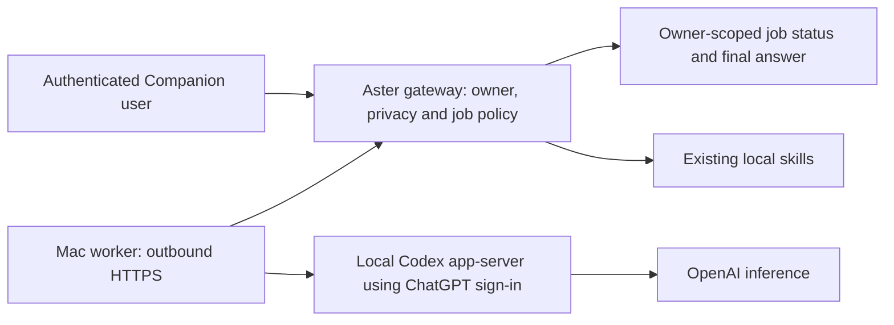

# D3 placement and worker lifecycle checkpoint — 2026-10-06

## Verified current state

Read-only direct SSH through the known Proxmox host confirmed LXC 104's
`aster-agent.service` active/running as `aster`, using one Uvicorn worker on
`192.168.70.10:9120`. MemoryCurrent was 45,203,456 bytes at inspection; that
instantaneous sample is not a resource budget or capacity benchmark.

Live `/opt/aster-agent/aster_agent.py` and this worktree's source both hash to
`24bdc580f074003fe8fbb064c0f5effbded9f15a33e0a8ef07b37075d6511fb0`.
This proves that one file matches, not that every dependency or auxiliary file
matches. A credential-free HTTPS GET to the existing Companion page from the Mac
returned 200 with normal certificate verification. That verifies page reachability,
not authenticated worker access or an Authentik sign-in.

Repository intent in the [Companion runbook](../../../runbooks/Aster-Companion.md)
places private HTTPS on NPM LXC 107 and identity on Authentik. Those components
were not separately audited in this read-only check. The successful D2 Codex
authentication remains on the existing Mac; no credentials have been copied.

## Proposed placement — not yet deployed

Keep Companion/API and its user authentication on LXC 104. Keep the first Codex
worker on the existing Mac. Prefer worker-initiated HTTPS to the existing private
Aster endpoint, so the Mac needs no inbound listener. This is a recommendation
for the pilot, not approval of a new worker identity or route.

The worker must have a narrow workload identity, separate from the user's
Companion bearer token and Codex subscription credential. Reuse the existing
identity/AI-PAM governance for issuance and revocation; do not create a bespoke
trust bypass. Worker endpoints must not accept arbitrary owners, tools or scope
from client JSON. The gateway authorizes cloud dispatch and binds owner/job/model/
data scope before work is offered. The worker validates the envelope and returns
only correlated status, approved final output and numeric usage.

Gateway state is the owner-facing job record; the worker ledger proves whether
dispatch was attempted and binds Codex thread/turn IDs. They need an explicit
receipt/reconciliation protocol. A poll timeout or expired lease must never
reassign an uncertain job for automatic execution. First pilot: one worker,
no automatic failover. Local file locking does not solve distributed exactly-once
execution; two-ledger reconciliation is still an implementation requirement.

Mac sleep, loss of authentication or disconnection makes Codex delegation
unavailable/uncertain. Existing local skills continue independently. No new
hardware, public endpoint, firewall change or credential transfer is proposed
for this checkpoint. Actual worker-auth mechanism and route allowlist require
inspection and a concrete deployment review before enabling them.

## Implemented locally and tested

`runtime.py` is an explicit local state owner, not a daemon. Disabled by default
means no files, processes or network side effects. When explicitly enabled in
tests, it creates private state, obtains a nonblocking exclusive file lock before
opening the ledger, rejects insecure/symlink state, and marks unfinished records
unknown on restart or shutdown. It never claims those remote jobs stopped.

A subprocess was terminated via immediate exit without cleanup. A new runtime
acquired the released OS lock, preserved thread/turn IDs and marked the job
unknown; a duplicate claim remained rejected. Completed records remain completed.
An overlapping worker is refused. Candidate tests use disposable state only.

The pilot ledger has a 64-job cap and bounded identifiers. It stops accepting
new work when full; it does not silently delete uncertain execution history.
Numeric telemetry expires from access after 24 hours and is removed on startup
or explicit maintenance. Dispatch identifiers remain for deduplication, bounded
by the cap. Long-term archival/tombstone policy is still required before general
use. SQLite row deletion is logical retention, not guaranteed forensic erasure;
Codex's separate transcript retention is unaffected.

**80 Python tests and five Node renderer scenarios pass.** No live infrastructure
mutation, new cloud turn, authentication change or Git push occurred.

## Exact resume

Implement and test the disabled gateway/worker receipt protocol locally: owner
and scope binding, stale-worker updates, unknown dispatch, explicit reconciliation,
result recovery and backpressure. Bind this to the existing Companion auth
dependency without sending personal auth tokens to the Mac worker. Preserve the
independent local route. Then prepare a finite authenticated fixture pilot with
specific worker identity, endpoint, lifetime, rollback and cancellation/usage
acceptance. Do not enable production merely because local lifecycle tests pass.
