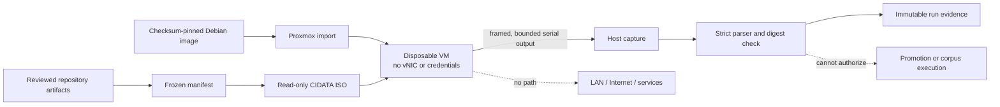

# Disposable S0 VM — concrete build and fixture-validation plan

Date: 2026-09-26  
Status: **review candidate; no VM creation, image download or execution authorized by this document**  
Scope: invented fixtures only; accepted S0 corpus remains blocked

## Decision

**Build one disposable, networkless QEMU VM as a new S0 execution boundary, then
prove the boundary using invented fixtures before considering accepted data.** The
VM is infrastructure for an experiment, not a service, agent, model host or new
source of authority.

Use a checksum-pinned Debian 13 `generic` cloud image, an immutable NoCloud seed
ISO and a bounded serial result protocol. Do not use the existing netinst ISO for
this first proof: it is authentic and remains useful recovery media, but an
unattended offline install adds installation state and package-selection variance
without improving the isolation claim. Do not install or enable QEMU Guest Agent,
SSH, a virtual NIC or a host/guest shared filesystem.

This plan replaces the unresolved artifact-channel choice in
`DISPOSABLE-VM-DESIGN.md`. It does not authorize the changes it describes.

## Evidence classification

### VERIFIED CURRENT STATE

Read-only inspection on 2026-09-26 established:

- Proxmox VE 9.2.20 on a 20-core/40-thread Xeon E5-2698 v4 host;
- 84,241,424,384 bytes total and 49,421,041,664 bytes available memory at the
  observation instant, with near-zero swap use;
- 665,394,887 KiB available on active `local-lvm` and 68,658,332 KiB available on
  active `local` storage at the later storage query;
- VMID 118 was the next ID at one instant, but is not reserved;
- `/usr/bin/genisoimage`, `/usr/bin/socat`, `/usr/bin/timeout`, `/usr/bin/script`,
  `/usr/bin/qemu-img` and `/usr/bin/qemu-nbd` exist on the Proxmox host;
- current local VMs demonstrate OVMF, q35, `virtio-scsi-single`, `local-lvm` and
  `serial0: socket`; and
- Proxmox `qm terminal` officially exposes a configured serial socket, while `qm
  disk import` accepts a QEMU-supported image and an explicit target disk.

Debian's dated 2026-09-14 directory publishes
`debian-13-generic-amd64-20260914-2601.qcow2` (approximately 414 MiB) with SHA-512:

```text
a733e7d49442a03e70d03e4eb5aaf3967f3efc69ef70952f9bb10fc1ee2c4876eb95956b5ad2d31350e5fada768feb651352535fb8cd1233f61998a5a7d2e93c
```

The dated directory, not the mutable `latest` alias, is the proposed source:

- [Debian dated cloud-image directory](https://cloud.debian.org/images/cloud/trixie/20260914-2601/)
- [Debian dated SHA512SUMS](https://cloud.debian.org/images/cloud/trixie/20260914-2601/SHA512SUMS)

Debian documents that the `generic` image uses its standard kernel and recommends
it for maximum compatibility. Debian also deliberately omits QEMU Guest Agent
because it assumes a host/guest trust integration. Those properties support the
portable image choice and the decision not to add an agent merely for convenience:
[Debian cloud-image FAQ](https://wiki.debian.org/Cloud).

Cloud-init documents that NoCloud can configure an instance locally without
network access and can discover an ISO9660 filesystem labelled `CIDATA` containing
root-level `user-data` and `meta-data`. It also documents the `genisoimage` method:
[cloud-init NoCloud datasource](https://cloudinit.readthedocs.io/en/latest/reference/datasources/nocloud.html).

### REPOSITORY INTENT

The S0 experiment is a descriptive comparison of fixed, standard-library routing
methods. It must deny network and subprocess access, use pinned inputs, cap wall
time/RSS/output, retain every failure and never interpret a successful run as
promotion authority. The accepted 30-family corpus has not executed.

### PROPOSAL

The exact VM, bootstrap, serial protocol and staged gates below are proposed.

### UNKNOWN / REQUIRES VERIFICATION

- The dated Debian image has not been downloaded or booted locally.
- Its exact serial-console and cloud-init behavior under this Proxmox configuration
  has not been observed.
- The `qm terminal` capture wrapper and framed parser have not been fixture-tested.
- One GiB RAM and the systemd restriction set have not been proven on this image.
- No VMID, capacity, storage extent or maintenance window is reserved.

## Frozen build inputs

The build candidate must contain a machine-readable manifest binding:

1. the dated Debian image URL, filename, byte length and SHA-512 above;
2. the downloaded `SHA512SUMS` bytes and their own SHA-256;
3. the seed source files, generated ISO SHA-256 and ISO file listing;
4. exact runner, router, validator and invented-fixture SHA-256 values;
5. the VM configuration rendered before creation;
6. the host-side capture/parser source and tests;
7. a unique build ID, fixture run ID and creation timestamp; and
8. an explicit statement that accepted-corpus hashes and bytes are absent.

Download to a fresh `.part` path, require the expected byte count and SHA-512,
then atomically rename. A mismatch stops the build. Never substitute the then-current
`latest` image or refresh packages inside the networkless guest. A newer base image
is a different candidate and needs a new manifest and fixture proof.

## Proposed VM configuration

The VMID is allocated only at creation time after a fresh uniqueness check. `118`
is evidence of a past query, not a planned constant.

| Setting | Required value | Control purpose |
|---|---:|---|
| Name | `aster-s0-fixture-<build-id>` | Unique, visibly non-production |
| Description/tags | disposable S0; fixture-only; no corpus | Prevent role ambiguity |
| vCPU | 1 core, 1 socket; `x86-64-v2-AES` | Portable bounded compute |
| CPU limit/weight | 1 core; low/default weight | Protect household workloads |
| RAM | 1024 MiB fixed; balloon 0 | Deterministic ceiling |
| Machine/firmware | q35 + OVMF; 4 MiB vars, no enrolled keys | Match current local convention |
| OS disk | imported dated image, `local-lvm`, grow to 8 GiB | Disposable guest state |
| Controller | `virtio-scsi-single`; discard on | Existing local convention |
| Seed input | reviewed ISO9660 `CIDATA`, read-only CD-ROM | Immutable local bootstrap/input |
| Serial | `serial0: socket`; display `serial0` | Bounded result and diagnosis path |
| Network | **no `netN` device at all** | Structural LAN/Internet denial |
| Agent | disabled/absent | Avoid host command/file authority |
| Other devices | no GPU, USB, PCI, TPM, audio or shared memory | Minimise attack surface |
| Shared storage | none; no VirtioFS/9p/host directory | Deny host-filesystem reach |
| Boot/start | manual, `onboot=0`, HA disabled | No unattended household dependency |
| Credentials | no password, SSH key, token or secret | Synthetic/public inputs only |
| Backup | excluded from routine guest backups | Rebuild from pinned evidence |

Do not add a disconnected NIC as a placeholder. The rendered and live Proxmox
configuration must prove that every `netN`, host device, shared-filesystem and agent
field is absent. Host firewall rules are not a substitute for device absence.

## Trust and data flow



Proxmox controls VM lifecycle and resource allocation. Cloud-init performs a
one-time local bootstrap. A dedicated unprivileged guest account runs only the
reviewed payload. The payload cannot grant host authority; the host parser accepts
data, never commands.

## Seed and guest lifecycle

The generated ISO contains only:

- `meta-data` with a unique instance ID and fixture-only hostname;
- `user-data` that locks interactive authentication, creates an unprivileged
  runner identity, writes pinned files from encoded/manifest-checked content,
  installs a systemd unit and starts it once;
- the reviewed payload bundle and manifest; and
- no network configuration, secret, credential, accepted-corpus file or package.

No package installation or upgrade occurs at first boot. Set cloud-init package
upgrade off. Root remains locked; password authentication and SSH key injection are
absent. The runner unit must use, subject to fixture proof:

- `User=`/`Group=` for the dedicated identity;
- `NoNewPrivileges=yes`, an empty capability bounding set and private devices;
- `ProtectSystem=strict`, `ProtectHome=yes`, `PrivateTmp=yes` and one fresh bounded
  writable output directory;
- `RestrictAddressFamilies=AF_UNIX`, no subprocess-capable adapter and no sockets
  passed to the process;
- `MemoryMax=512M`, `TasksMax=64`, `CPUQuota=100%` and a 90-second runtime limit;
- read-only pinned inputs and exact source hashes; and
- poweroff after a terminal success or failure record is flushed.

The current runner's internal 60-second/256-MiB/2-MiB limits remain defense in
depth. The VM and unit apply independent outer limits.

## Serial result protocol

Serial is an output-only evidence channel. The runner writes canonical JSON to a
file first, enforces the 2-MiB limit, computes its SHA-256 and emits:

```text
ASTER_S0_V1 BEGIN <run-id> <manifest-sha256> <bytes> <sha256> <chunks>
ASTER_S0_V1 CHUNK <run-id> <zero-based-sequence> <base64-data>
ASTER_S0_V1 END <run-id> <bytes> <sha256>
```

Raw chunks contain at most 3,072 bytes. The parser:

- caps the entire captured stream at 4 MiB and wall time at five minutes;
- ignores boot text outside the exact prefix but retains the bounded raw capture;
- accepts exactly one BEGIN and END for the expected run/manifest;
- requires consecutive, unique chunk numbers and the declared count;
- rejects unknown fields, malformed base64, excess bytes, digest mismatch,
  duplicate completion and trailing protocol records; and
- writes the decoded result atomically only after all checks pass.

No serial input is required. Proxmox documents `qm terminal` for `serial0: socket`;
the build milestone must prove a bounded PTY capture using the host's existing
`script` and `timeout` tools. Direct socket access through `socat` is a diagnostic
fallback to investigate, not an assumed production interface.

The guest keeps the output on its disposable OS disk until the run is reviewed. A
capture failure is retained as a failed/inconclusive experiment. It does not cause
an automatic retry. Offline disk inspection with `qemu-nbd` is a separately reviewed
forensic recovery path, not the normal result path.

## Build and proof milestones

### V0 — local candidate and parser tests

No Proxmox mutation.

- Generate manifest/seed sources with invented fixtures only.
- Implement and test the framed encoder/parser for truncation, oversize, duplicate,
  reorder, bad base64, wrong run/manifest, digest mismatch and extra records.
- Prove the seed contains no accepted-corpus digest, credential or network setting.
- Produce the exact proposed VM configuration and rollback commands for review.

**Gate:** all local tests pass; candidate hashes are frozen; independent review
finds no corpus or secret; operational approval names the exact mutation envelope.

**Current checkpoint:** candidate seed sources and VM configuration now exist under
[`vm-candidate-v0/`](vm-candidate-v0/). The pure serial encoder/parser has 12 focused
synthetic tests and the deterministic candidate renderer/validator has 8, all
passing; the full adaptive suite passes 234 tests. YAML parsing and persisted
manifest verification pass. ISO generation, `qm terminal`
capture behavior and all Proxmox mutation remain untested and unauthorized.

**V1/V2 outcome:** after explicit approval, V1 created stopped VM118 and its exact
configuration passed the no-vNIC/no-agent gate. The one V2 bootstrap boot failed
safely: cloud-init invoked the canary unit, the unit failed before emitting any
protocol record, and the fallback powered the VM off. The parser rejected the
105,115-byte capture as incomplete. Evidence is retained in
[`run-v2-bootstrap/`](run-v2-bootstrap/). V3 is blocked; no retry or offline disk
inspection was authorized by the consumed V2 approval.

**Forensic/correction checkpoint:** a later approved read-only inspection proved
`status=209/STDOUT`: `PrivateDevices=yes` prevented systemd from attaching the
unit directly to `/dev/ttyS0`. Candidate
[`vm-candidate-v1/`](vm-candidate-v1/) retains private devices and instead writes a
bounded protocol file that the outer cloud-init lifecycle publishes after unit
success. Twenty-one focused and 235 full adaptive tests pass; YAML, shell syntax
and persisted hashes validate. A new seed, fresh VM and V2b boot remain
unauthorized, and V3 remains blocked.

### V1 — create but do not boot

At the approved window, recheck host health, memory, storage, next VMID and name
uniqueness. Stop if available memory is below 8 GiB, local-lvm free space is below
16 GiB, swap is actively growing, Proxmox is degraded, or the observed topology
differs materially from this plan.

Download and verify the dated image and checksum file; create the stopped VM; import
and resize its disk; attach the immutable seed; render the resulting configuration.
Do not boot until the configuration checker proves no NIC/agent/passthrough/share,
fixed memory, manual start and the exact disks/hashes.

**Gate:** stopped VM matches the frozen configuration; no existing VM or service was
changed; source files and imported volume identities are retained.

### V2 — bootstrap canary

Boot once with a bootstrap-only seed that emits image/cloud-init/runtime facts and
one fixed canary result, then powers off. It contains no routing engine or corpus.
Capture must prove framing, size/digest validation, serial availability, wall-time
termination, VM poweroff and absence of a network device inside and outside the
guest.

**Gate:** one structurally valid canary result from the pinned candidate. This
proves bootstrap and capture only; the fresh V3 disk provides the second build
observation needed for a repeatability claim.

### V3 — invented S0 fixture

Import a second OS disk from the original pinned image, retain the stopped V2 disk
unattached for review, and use a new seed/run identity. Only one OS disk is attached
or running at a time. Execute the existing invented fixture only. Validate systemd
restrictions, runner budgets, prohibited network/process attempts, result integrity
and host/guest state before and after.

**Gate:** one successful fixture result plus explicit negative tests; any boundary
escape, unbounded capture, unexpected device or inability to stop the VM is NO-GO.

### V4 — boundary decision

Preserve configuration, captures, decoded output, hashes, resource telemetry and
all failures. Decide whether the VM is a suitable execution context. Do not infer
router quality from fixtures and do not run the accepted corpus.

**Gate:** an architecture decision explicitly says GO/NO-GO and identifies residual
risk. A GO permits preparation of a separately pinned accepted-corpus candidate;
it does not authorize that run.

## Failure, stop and recovery semantics

| Failure | Required response |
|---|---|
| Image/checksum mismatch | Delete only the incomplete `.part`; retain failure evidence; no import |
| Capacity/topology gate fails | Do not create/start; record snapshot; reschedule |
| Config contains NIC/agent/share/device | Keep stopped; correct only under the reviewed build envelope or roll back |
| Bootstrap/canary fails | Stop VM at deadline; retain disk and bounded capture; diagnose before another build |
| VM does not power off | Issue one host-side hard stop after deadline; retain as failure |
| Parser rejects output | Preserve raw capture; no retry; result is failed/inconclusive |
| Host workload degrades | Stop the disposable VM; verify household guests; end experiment |
| Unexpected secret/corpus detected | Stop, quarantine local evidence from Git, investigate provenance |
| Proxmox/storage error | Stop; do not destroy recovery evidence; verify storage/guest health |

Rollback before first boot is detaching/removing only newly created disposable
volumes and VM configuration after receipt checks. After boot, prefer stop and
preservation until diagnosis. Destruction is an explicit later cleanup operation;
the repository's non-waivable destructive-action rule still applies. Never delete
or alter VM105 or any service guest as rollback.

## Observability and repository evidence

Record build/run IDs, VMID, host/PVE version, source and seed hashes, rendered VM
configuration, start/stop timestamps, peak host-observed CPU/memory, capture byte
count/hash, parser verdict, guest self-report, unit exit status and pre/post running
guest inventory. Do not export environment variables, kernel command lines that may
contain secrets, raw host logs or unrelated VM configuration.

The disposable VM is not a service and needs no Homepage tile, DNS, certificate,
firewall opening, Authentik client, OpenBao role or routine backup. NetBox impact is
**not applicable while it has no interface/IP and is temporary**; if it becomes a
persistent platform component, reassess registration. HomeLab Doctor should not
monitor the stopped disposable guest as production availability, but the eventual
launcher must report stale/running-orphan experiment state.

## Change envelope requiring approval before V1

The concrete infrastructure request will be limited to:

1. download the exact dated 414-MiB Debian image and checksum file to Proxmox local
   staging, verify them, and retain the verified image;
2. create one new stopped disposable VM using the next free VMID and the exact
   configuration above;
3. allocate at most two 8-GiB thin OS disks (one attached at a time) plus one 4-MiB
   EFI vars disk on `local-lvm`, retaining the V2 disk as evidence through review;
4. upload/attach one reviewed seed ISO on `local`;
5. boot/stop only that VM for V2 and V3 fixture validation; and
6. retain the stopped VM and evidence for review; do not destroy it automatically.

It excludes accepted-corpus access, changes to existing guests, VLAN/DNS/firewall/
identity/secrets, package installation on Proxmox, GPU use, on-boot enablement,
backup-policy changes and VM destruction.

## Go/no-go recommendation

**GO to V0 local candidate construction. GO WITH A SEPARATE CONCRETE APPROVAL to V1–V3.**
The VM design is materially safer and simpler than further LXC100 experimentation,
but current evidence does not prove the image boots, the serial channel is reliable
or the confinement works. Those are exactly the falsifiable questions V2–V3 answer.
