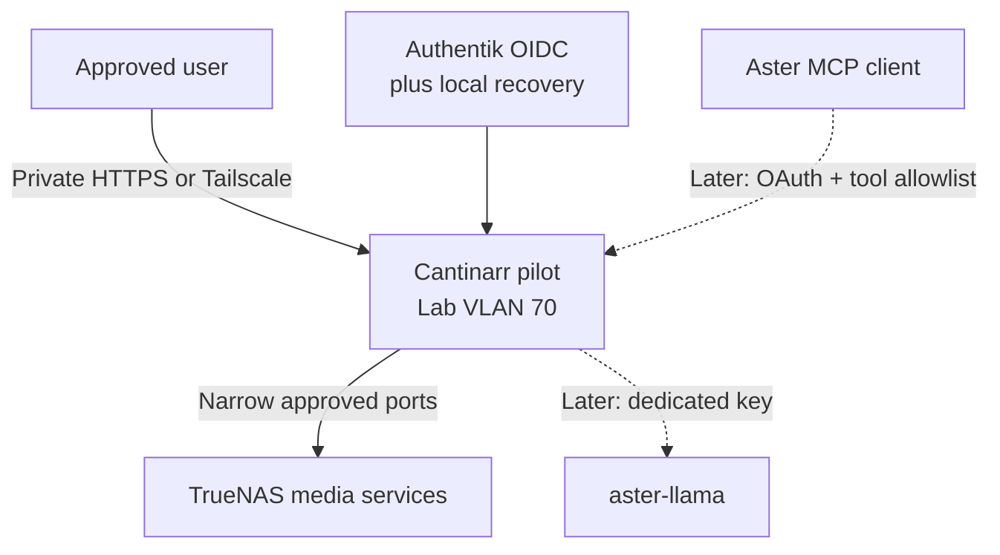

# Cantinarr Evaluation and Controlled Pilot

> Status: Proposed — Stream M; project creation only, implementation not yet
> started
>
> Project owner: Jason
>
> Proposed: 2026-09-17
>
> Authorization stream: Stream M — every production state change and external
> write requires a fresh, bounded approval

## Purpose and desired outcome

Evaluate Cantinarr as a private household media-discovery/request interface,
operator console and possible governed media-specialist endpoint for Aster.
The project must determine, with evidence, whether Cantinarr should:

1. remain an optional operator tool beside Seerr;
2. replace Seerr after a controlled household cutover;
3. expose a deliberately restricted read/request MCP surface to Aster; or
4. be removed because its risk, overlap or maintenance cost exceeds its value.

The desired outcome is a reversible pilot and a documented go/no-go decision,
not deployment for its own sake. Production media operation must remain
independent of Cantinarr throughout the pilot.

## Current state and evidence

### Existing HomeLab media control planes

- The current authoritative media stack runs on TrueNAS at `192.168.20.40`:
  Sonarr, Radarr, Lidarr, Prowlarr, SABnzbd and Jellyfin. The reviewed
  2026-09-09 inventory records Sonarr 4.0.19.2979, Radarr 6.3.0.10514,
  Lidarr 3.1.0.4875, Prowlarr 2.5.2.5491, SABnzbd 5.1.2 and Jellyfin
  10.11.11. Reconfirm every version and endpoint before implementation.
- Seerr remains an operational household media-request service represented in
  Homepage. Its Authentik/client-sensitive onboarding remains in the active
  Authentik rollout; it is not retired by creating this project.
- Aster’s completed ARR Stack Manager uses a source-local sanitized report and
  a stopped-by-default, credential-isolated execution broker. Only one narrow
  stale-Radarr-queue dismissal has graduated, and each live attempt still
  requires separate approval. Cantinarr must not silently bypass or supersede
  that boundary.
- Sonarr, Radarr, Lidarr, Prowlarr and SABnzbd already have private HTTPS names
  behind Authentik forward auth. Their direct private APIs remain available to
  existing integrations and are outside that browser-auth path.
- The local OpenAI-compatible inference service runs on LXC 110 in Lab VLAN 70
  with per-consumer bearer keys. It is a possible later Cantinarr provider,
  not a prerequisite for the basic pilot.

### Cantinarr upstream baseline

Read-only upstream review on 2026-09-17 found:

- public AGPL-3.0 source at
  `https://github.com/windoze95/cantinarr`;
- latest published semantic-version tag `v0.14.0`, commit
  `ab61a233e4d5442ad9b8147c7c42eac8cb1f01de`, dated 2026-09-15;
- a single Go/SQLite server container with embedded Flutter web application,
  normally published on TCP 8585 with persistent state under `/config`;
- stable, fixed-version, release-candidate and edge image channels, with
  fixed releases available for both amd64 and arm64;
- mobile applications still described upstream as beta;
- direct integration with Radarr, Sonarr, Lidarr, Chaptarr, download clients,
  Jellyfin/Plex/Emby/Audiobookshelf, OIDC, hosted or local AI, remediation and
  an OAuth-secured MCP server;
- approximately 40 externally exposed MCP tools, with individual tool toggles;
  and
- an optional community push gateway in the example Compose configuration.

This is a fast-moving 0.x project with an unusually broad authority surface.
The latest tag is not sufficient change control for this lab: deployment must
pin an exact release and, where practical, its image digest after review.
Upstream main-branch documentation may describe features newer than the pinned
stable release, so every relied-on behavior must be verified against the
deployed version.

## Scope

- Review the pinned upstream release, container, dependencies, credential
  storage, database/encryption-key handling, outbound calls, update process,
  backup requirements and security-relevant defaults.
- Deploy one isolated, resource-bounded pilot instance without production
  service credentials, media mounts, Internet ingress or household dependency.
- Validate discovery, authentication, authorization and restart/restore
  behavior using synthetic or disposable data before any production API key is
  introduced.
- Compare Cantinarr with Seerr for household discovery, requests, approvals,
  parental controls, mobile use and administrative burden.
- Evaluate Import Doctor and issue diagnosis before enabling any repair.
- Evaluate local AI through the existing `aster-llama` endpoint only after the
  non-AI pilot is stable and capacity is measured.
- Evaluate an OAuth-secured, allowlisted MCP surface for Aster only after the
  in-app permission model and audit trail pass adversarial tests.
- Produce a documented keep-beside, replace-Seerr or remove decision.

## Explicit exclusions

- No immediate Seerr replacement, request-history migration or household
  cutover.
- No public port 8585, new WAN port forward or public Cloudflare application.
- No production media-library mount during the initial pilot; completed-media
  downloads remain disabled.
- No community push relay, Discord webhook, Trakt account, Plex sign-in,
  personal ChatGPT OAuth or hosted AI credential during the initial pilot.
- No automatic remediation, standing “Always approve” rule, force import,
  queue deletion, blocklist, replacement search, media deletion, profile write,
  custom-format write or Jellyfin account lifecycle management until that
  exact action has its own evidence and approval gate.
- No raw ARR, downloader or Jellyfin credential in Aster, an Aster prompt,
  Git, Homepage, Doctor output or the human wiki.
- No weakening or replacement of the existing Aster ARR sanitized-reader and
  broker boundary merely because Cantinarr exposes a convenient MCP tool.
- No assumption that Cantinarr subsumes the separate Recommendarr project; the
  overlap must be resolved explicitly before either project is implemented.

## Authority model

| Fact or action | Authority |
|---|---|
| Current service versions, health, queues and library state | Live TrueNAS services and their reviewed, sanitized operational evidence |
| ARR indexer, acquisition, import, naming and monitoring configuration | The relevant ARR application; Prowlarr remains indexer authority |
| Download state | SABnzbd; completion does not prove ARR import |
| Playback/library visibility and household media users | Jellyfin |
| Existing request workflow during the pilot | Seerr and its current production state |
| Aster ARR advice and existing graduated repair boundary | Completed Aster ARR Stack Manager project and its broker contract |
| Cantinarr configuration, users, approvals and pilot audit | The pinned pilot instance and its protected `/config` state |
| Architecture, risk decisions, milestone evidence and accepted exceptions | This project document and the HomeLab repository |
| Guest, address, VLAN and service inventory | NetBox once resources are assigned |

Cantinarr is an orchestration and presentation layer, never the authoritative
source for whether a file, queue record, user or service actually exists. A
disagreement with an authoritative source is drift to investigate, not a fact
for Cantinarr to overwrite automatically.

## Proposed architecture and data flows

The pilot should use a new unprivileged LXC on Lab VLAN 70. NetBox must assign
the guest number and address at implementation time; this document does not
pre-allocate either.

Initial connectivity is deliberately smaller:

| Flow | Initial state | Pilot expansion rule |
|---|---|---|
| Trusted administrator to Cantinarr TCP 8585 | Private direct access for setup only | Replace with private HTTPS after the credential-free gate |
| Cantinarr to Internet TCP 443 | Allow only what catalog/release verification requires | Record actual destinations; do not assume every outbound host is necessary |
| Cantinarr to TrueNAS media-service ports | Denied | Add one destination/port at a time after a checkpoint and explicit Stream-M approval |
| Cantinarr to `aster-llama` | Denied | Add only in the local-AI milestone with a dedicated key and capacity evidence |
| Aster to Cantinarr MCP | Denied | Add only in the MCP milestone after tool allowlisting and denied-action tests |
| Internet to Cantinarr | Denied | Remains out of scope for this project |

## Privacy and security design

- Run the container rootless/non-root where the pinned release supports it;
  keep `/config` on a dedicated mount with restrictive ownership and modes.
- Use exact service-specific credentials where the application supports them.
  Treat every ARR API key as broadly capable unless a live denied-write test
  proves otherwise.
- Keep credentials and encryption material in protected runtime storage only.
  Record their location, owner and rotation procedure without values.
- Retain one tested local administrator as break-glass when enabling Authentik
  OIDC. Disable self-sign-up and map only explicit users/groups during pilot.
- Do not enable SSO-only mode until local recovery has been exercised.
- Disable the community push relay and every optional external integration by
  default. Review the data leaving the network before enabling any one of them.
- Use the local AI provider first. Cantinarr must not receive a personal or
  shared ChatGPT subscription token merely for convenience.
- Treat title searches, library names, request history, watch state and issue
  reports as household data. Minimize logs and do not expose them to Aster
  unless the approved MCP tool requires that exact field.
- Leave media roots unmounted initially. If a later completed-media download
  test is approved, mount only explicit roots read-only and validate path
  containment and short-lived link behavior with synthetic files first.
- Pin the release and review upstream changes before upgrade. Never run the
  edge channel against production credentials.

## Pre-start risk assessment

| Risk | Likelihood / impact | Control and residual risk |
|---|---|---|
| Compromise of Cantinarr exposes broadly capable ARR/download credentials | Medium / High | Isolated LXC, narrow egress, per-service credentials, no media mount, protected state, pinned version and rotation drill. Residual risk remains higher than the existing source-local Aster broker. |
| Cantinarr and Seerr create duplicate or conflicting requests | Medium / High | Seerr remains authoritative; credential-free and disposable testing precede one explicitly approved production request; no bulk import/cutover. |
| Cantinarr MCP bypasses Aster’s graduated action boundary | Medium / High | No MCP path initially; tool-by-tool allowlist, separate OAuth identity, read/request-only first, destructive/profile tools denied and regression against the existing ARR curriculum. |
| Remediation deletes, blocklists or reacquires the wrong content | Medium / High | Remediation and standing approvals off; synthetic fault first; exact file/queue evidence and one-action approval required; no production destructive test without separate risk acceptance. |
| Young `0.x` release regresses or changes schema/API behavior | Medium / Medium | Exact version/digest pin, pre-upgrade backup, restore test, release review and staged upgrades. Residual risk accepted only while production remains independent. |
| Household metadata leaves the network through push, Trakt, Discord or hosted AI | Medium / Medium | All optional outbound integrations off; local AI only; destination/data-flow review before any exception. TMDB/catalog requests remain an inherent external metadata flow and must be documented. |
| OIDC or reverse-proxy error locks out the administrator | Low / Medium | Local admin retained and tested; direct private path preserved until OIDC passes clean-session and logout tests. |
| `/config` loss destroys users, approvals, database or encryption key | Low / High | Application-consistent backup of the complete mount; integrity and isolated restore tests before real credentials or household use. |
| Shared local inference degrades Aster or other consumers | Medium / Medium | No AI in base pilot; dedicated key, bounded model, concurrency measurement and two production-path passes before acceptance. |
| Pilot becomes an undocumented dependency | Medium / Medium | Seerr and direct ARR interfaces remain available; Doctor labels Cantinarr as pilot; rollback removes it without changing source services. |

## Recovery, rollback and abort conditions

Before the first production credential or network rule, capture:

- the current ARR/Seerr/Jellyfin configuration checkpoint appropriate to the
  next action;
- the Cantinarr LXC and `/config` state;
- the exact firewall and DNS state; and
- credential inventory metadata without credential values.

Rollback is: stop Cantinarr; remove its narrow firewall/DNS/proxy rules; revoke
its service, OIDC, AI and MCP credentials; restore the prior source-service
checkpoint only if Cantinarr actually changed that service; and verify Seerr,
direct ARR interfaces, Jellyfin and the Aster ARR report/broker remain in their
prior state.

Stop immediately on an unexpected write, undeclared outbound destination,
credential disclosure, database corruption, inability to verify a checkpoint,
broader-than-documented MCP capability, unexplained media change or conflict
with an existing automation.

## Persistence and resume plan

This document is the durable checkpoint. At every milestone, update the status,
current version/digest, exact next safe action, validation state, rollback
location and evidence log before a long-running test or session end.

On resume:

1. re-read `AGENTS.md`, `docs/Project-Creation-Standard.md` and this project;
2. inspect Git status and the latest project evidence;
3. revalidate upstream stable release and the live ARR/Seerr/Jellyfin baseline;
4. confirm the last accepted Cantinarr state and checkpoint still exist;
5. verify no credential, firewall rule, mount or MCP tool appeared outside the
   recorded milestone; and
6. continue only from the first unchecked gate.

Any automation introduced later must use locking, bounded retries, explicit
last-success state and atomic candidate/accepted transitions. Absence of a
process is never proof of success.

## Milestones

### Milestone 0 — Upstream and live discovery

- [ ] Reconfirm the latest stable Cantinarr release, image digest, license,
  supported architectures and release notes.
- [ ] Review the pinned source and image build for dependencies, secret
  storage/encryption, migrations, network clients, telemetry/update checks,
  push behavior and security-reporting process.
- [ ] Reconfirm live Seerr, ARR, downloader, Jellyfin, Authentik, NPM,
  `aster-llama`, NetBox and backup versions/topology without reading secrets.
- [ ] Inventory every existing workflow that can request, search, grab, import,
  rename, delete, blocklist, unmonitor or manage Jellyfin users.
- [ ] Compare Cantinarr with Seerr, the Aster ARR manager and the proposed
  Recommendarr project; identify duplication, unique value and conflicts.

Gate: a reviewed capability/authority matrix shows exactly what Cantinarr adds,
duplicates and could bypass. No Cantinarr container or credential exists.

### Milestone 1 — Architecture decision and pre-change approval

- [ ] Confirm the pilot LXC, VLAN, resources and NetBox-assigned address.
- [ ] Decide whether the pilot target is operator-only or includes a small
  household test group.
- [ ] Decide the allowed catalog providers and outbound destinations.
- [ ] Present the refreshed risk assessment, exact first change, validation and
  rollback for Stream-M approval.

Gate: Jason accepts the bounded pilot design; no production credential or
service dependency is included implicitly.

### Milestone 2 — Credential-free isolated deployment

- [ ] Create an unprivileged, resource-bounded LXC on Lab VLAN 70.
- [ ] Deploy an exact Cantinarr release/digest with one persistent `/config`
  mount, no media mount and no community push gateway.
- [ ] Create the local break-glass administrator and disable open registration.
- [ ] Validate catalog browsing, login, restart, container/LXC reboot, update
  detection and denied network paths.
- [ ] Capture and restore `/config` in an isolated disposable target.

Gate: the pinned instance survives restart and isolated restore, has no
production service credential, and cannot reach an unapproved internal port.

### Milestone 3 — Synthetic/disposable service integration

- [ ] Use disposable API fixtures or test instances for Radarr, Sonarr,
  downloader and Jellyfin behavior before production.
- [ ] Enumerate every endpoint/method Cantinarr calls for discovery, request,
  queue management, import, profile changes, remediation and user management.
- [ ] Test malformed, stale and adversarial responses plus restart during a
  pending request.
- [ ] Confirm disabled tools/actions are actually denied, not merely hidden.

Gate: observed network/mutation behavior matches the documented capability
matrix and no request can escape the disposable targets.

### Milestone 4 — One-service monitored production pilot

- [ ] Take fresh source-service and Cantinarr checkpoints.
- [ ] Create/rotate one dedicated service credential and add one exact firewall
  destination/port after approval.
- [ ] Observe read/state synchronization before approving one reversible,
  low-blast-radius action.
- [ ] Verify the source directly, inspect Cantinarr’s audit record, test replay
  behavior and revoke/restore the path if any postcondition differs.

Gate: one production integration behaves exactly as reviewed without affecting
Seerr, unrelated ARR services, Jellyfin playback or existing automation.

### Milestone 5 — Seerr and household workflow comparison

- [ ] Compare discovery/search quality, approvals, season selection, quality
  controls, parental controls, notifications, mobile/browser use and support
  burden using the same bounded scenarios.
- [ ] Validate that duplicate submissions and partially available titles are
  handled safely.
- [ ] Record request-history/export and user-migration limitations.
- [ ] Select keep-beside, replace later or reject; do not cut over yet.

Gate: Jason chooses the intended long-term household role based on observed
behavior, with Seerr still operational and recoverable.

### Milestone 6 — Authentik and private client access

- [ ] Configure dedicated Authentik OIDC with explicit bindings and no open
  account creation; preserve and test local recovery.
- [ ] Add private HTTPS/split DNS only; keep the direct path during validation.
- [ ] Test clean-session login, logout, denied user/group, expired session,
  mobile/browser behavior and callback handling.
- [ ] Evaluate mobile beta applications through Tailscale/private HTTPS; no
  public ingress.

Gate: approved users authenticate correctly, denied users remain denied, local
recovery works and no non-browser service path regresses.

### Milestone 7 — Local AI and Import Doctor

- [ ] Measure current `aster-llama` capacity and create a dedicated Cantinarr
  key only if headroom exists.
- [ ] Connect the local OpenAI-compatible provider with no cloud fallback.
- [ ] Test recommendation and explanation quality against synthetic and known
  non-destructive issues.
- [ ] Validate hallucination, prompt-injection, stale-state and dependency-
  failure behavior; all repairs remain proposals.
- [ ] Run two independent production-path passes without enabling standing
  approvals or destructive actions.

Gate: AI output is bounded, local, attributable to live evidence and cannot
perform an unapproved repair.

### Milestone 8 — Restricted MCP evaluation

- [ ] Create a dedicated least-privilege OAuth identity for the test client.
- [ ] Enable only discovery, availability, request-status and other explicitly
  accepted read tools first.
- [ ] Prove disabled write/profile/import/remediation/file/user tools are
  inaccessible through direct calls, prompt injection and token replay.
- [ ] Compare the result with the existing Aster sanitized-report and broker
  pattern; retain the stricter boundary where capabilities overlap.
- [ ] Run Aster ARR, credential-refusal, destructive-request and current-state
  regression suites twice.

Gate: MCP adds useful capability without giving Aster raw credentials, generic
ARR administration or a bypass around action-specific approvals.

### Milestone 9 — Decision, integration close-out and graduation

- [ ] Execute the selected decision: retain as pilot/operator tool, approve a
  separate Seerr-cutover milestone, or remove Cantinarr completely.
- [ ] Close every applicable integration-checklist item below.
- [ ] Prove backup/restore and full rollback from the final chosen state.
- [ ] Record residual risks, update ownership and maintenance cadence, and
  complete a focused commit/push/mirror verification.

Gate: normal household media operation is supportable without the implementing
agent and remains functional if Cantinarr is stopped.

## Validation and evaluation matrix

| Class | Required evidence |
|---|---|
| Functional | Discovery, request, approval, availability and queue status match direct source checks for bounded scenarios |
| Authorization | Denied users, disabled tools, missing scopes and expired/replayed tokens fail without reaching source services |
| Mutation scope | Every observed write matches the approved target, method, object and postcondition; no implicit follow-on action occurs |
| Privacy | No credential, raw token, private path, unwanted watch history or release title appears in logs, Git, Doctor or model-visible output |
| Failure | Dependency outage, timeout, stale webhook, malformed response, interrupted restart and full disk fail closed and remain resumable |
| AI/MCP | Prompt injection, fabricated identifiers, stale state and requests for destructive/general administration are refused or held as proposals |
| Regression | Seerr, direct ARR interfaces, Jellyfin playback/scans, existing automation, Aster ARR curriculum and Homepage widgets remain healthy |
| Recovery | Complete `/config` restore, credential rotation and removal of the pilot leave no unexplained state or network access |
| Performance | CPU, RAM, database growth, API polling and local-inference contention remain within measured limits |

## Observability and maintenance

- Add HomeLab Doctor checks only after the pilot exists: container/service
  health, authenticated local health response, database/config backup age and
  version drift. Failure output must contain no titles, user history or tokens.
- Use Beszel for LXC resource history. Add Prometheus/Grafana only if the pilot
  exposes useful bounded metrics and a real operational question requires them.
- The existing ChatGPT scheduled task monitors upstream releases. It is an
  advisory input, not proof that an upgrade is safe or installed.
- Review release notes and security changes before every update. Prefer a
  deliberate soak period for non-security releases and never auto-update a
  credentialed production pilot.
- Name Jason as notification and upgrade owner until close-out delegates it.

## Backup, restore and rollback

- Protect the entire Cantinarr `/config` mount, including SQLite state and the
  encryption key it depends on, plus the LXC configuration and exact container
  release/digest.
- Keep secrets outside Git and outside ordinary backup manifests; protect them
  through the established credential/recovery store and document rotation.
- Add the LXC to the established Proxmox archive, TrueNAS same-site mirror and
  encrypted off-site scope only after size and sensitivity are measured.
- Before production credentials, restore the application-consistent backup to
  an isolated LXC with network denied and prove login, database integrity and
  configuration readability.
- Full removal rollback revokes all keys/tokens, removes Authentik/NPM/DNS/
  firewall objects, deletes the pilot guest only after its final checkpoint,
  and verifies source services plus Seerr remain unchanged.

## Documentation and systems-of-record integration checklist

- [ ] **HomeLab Doctor** — add bounded service, authenticated-health,
  backup-age and pinned-version checks after deployment; no library titles or
  queue details.
- [ ] **Monitoring/alerting** — Beszel resource history initially; evaluate
  whether Doctor alone is sufficient and avoid duplicate ARR queue alerts.
- [ ] **Backup and recovery** — protect LXC, `/config`, encryption dependency,
  version/digest and credential recovery metadata; pass isolated restore.
- [ ] **NetBox** — create the LXC, interface, IP, VLAN and service records only
  after NetBox assigns them.
- [ ] **Human wiki** — add an operator page only if Cantinarr is retained,
  covering purpose, access, authority limits, recovery and disable procedure.
- [ ] **Aster mirror/snapshot** — add only accepted architecture/operation
  facts with provenance; do not ingest credentials, user histories or raw
  Cantinarr state.
- [ ] **Operational reference and runbooks** — record final service version,
  location, dependencies, stop/start/update/restore and Seerr/Aster boundaries.
- [ ] **Repository documentation** — update architecture, addressing,
  operations, backup, authorization, portfolio and changelog only as facts
  become real.
- [ ] **Diagrams/rack records** — no physical/rack change; mark not applicable
  at close-out unless topology diagrams gain the logical LXC/service.
- [ ] **Homepage/service discovery** — add a private link only after the pilot
  is useful and authenticated; never embed credentials.
- [ ] **Authentication/authorization** — dedicated Authentik OIDC application,
  explicit bindings, local recovery and disabled open sign-up.
- [ ] **DNS, certificates and firewall** — private split DNS and the minimum
  source/destination/port rules; no Internet ingress.
- [ ] **Automation and schedules** — record webhook ownership, release-watch
  role, any maintenance schedule, concurrency protection and missed-run state.
- [ ] **Security inventory** — record every credential by purpose, owner,
  storage location and rotation/removal status without values.

## Graduation criteria

The project graduates only when:

- the long-term role relative to Seerr, Aster ARR and Recommendarr is explicit;
- the selected pinned release and its data flows have been reviewed and tested;
- no raw production credential reaches Aster or Git;
- every enabled write or MCP tool has a named owner and accepted boundary;
- standing destructive approvals remain absent unless separately risk-accepted;
- OIDC and local recovery, restart, dependency failure, backup/restore and full
  rollback pass;
- existing Seerr/ARR/Jellyfin automation and Aster regressions pass twice;
- all integration items are complete or marked not applicable with reason; and
- household media operation continues normally with Cantinarr stopped.

## Evidence log

| Date | Milestone | Evidence | Result |
|---|---|---|---|
| 2026-09-17 | Project creation | Reviewed the current project standard, portfolio, ARR operational reference, completed Aster ARR manager, active Authentik rollout and proposed Recommendarr project. Queried upstream tags; latest published semantic-version tag observed was `v0.14.0` at commit `ab61a233e4d5442ad9b8147c7c42eac8cb1f01de` dated 2026-09-15. | Proposal created as Stream M. No container, guest, credential, firewall rule, DNS record, mount, service integration or production change was made. |

## Close-out

Not applicable yet. The project is proposed and implementation has not begun.

## References

- `docs/Project-Creation-Standard.md`
- `docs/reference/ARR-Stack-Operational-Reference.md`
- `docs/projects/completed projects/Aster-Arr-Stack-Manager.md`
- `docs/projects/Authentik-Rollout.md`
- `docs/projects/Recommendarr-Watch-Recommendations.md`
- `docs/reference/Aster-Operations.md`
- `docs/05-Backups.md`
- `https://github.com/windoze95/cantinarr`
- `https://docs.cantinarr.com/`
